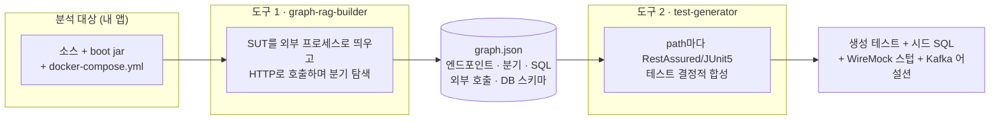

# graph-rag

Java/Spring 애플리케이션의 블랙박스 REST 테스트 자산(테스트 코드 + DB 픽스처 + mock 데이터)을
**결정적으로 생성**하는 시스템. 같은 입력이면 항상 같은 결과가 나온다. 기본 경로에 LLM은 없다(선택 기능 `--llm-oracle`을 켠 경우만 예외이며, 그때도 출력이 캐시로 고정된다).



## 시작하기

**[docs/00-getting-started](docs/00-getting-started.md)** 를 따라간다 — 데모 한 번(트랙 A) 후
자기 앱 적용(트랙 B) 순서다.

```bash
./e2e/run-e2e.sh   # 데모 전 사이클. 성공 시: ✅ E2E PASS — tests=N skipped=0 failures=0 errors=0
```

자기 앱에는 소스 빌드 없이 prebuilt를 쓴다 —
[Releases](https://github.com/baekchangjoon/graph-rag-test-generator/releases) zip 또는 GHCR 이미지
(`ghcr.io/baekchangjoon/{test-generator,graph-rag-builder}`). `test-generator`는 JRE 17만,
`graph-rag-builder`는 JRE 17 + Docker.

빌더/제너레이터의 모든 CLI 사용 예(기본·attach·Kafka·레거시 Sleuth·증분·에러 엔벨로프·삼중 합성)는
**[docs/03 "CLI 레시피"](docs/03-graph-rag-builder.md)** 에 있다.

## 입력을 어떻게 만드나 (요약)

happy 입력을 합성한 뒤 경계 변이와 입력 오라클(소스 리터럴 비교 + 바이트코드 심볼릭 실행/Z3,
선택적으로 LLM 값 오라클)로 후보를 만들어 호출하고, 새 분기를 연 입력만 path로 채택한다.
단계별 발견(Stage 0~4)이 유효 happy → 다필드 가드 → by-id 경로 → 저장된 행 상태 가드를 차례로 연다.
원리는 [docs/23-input-generation-flow](docs/23-input-generation-flow.md),
심화는 [docs/24-input-discovery-internals](docs/24-input-discovery-internals.md).

## 모듈

| 모듈 | 역할 |
|---|---|
| `graph-rag-builder` | 도구 1: SUT 분석 → 사실 캡처 → graph.json |
| `test-generator` | 도구 2: graph.json + 요청 → 테스트 합성 |
| `shared-model` | 두 도구가 공유하는 JSON 계약(그래프 사실·생성 요청) |
| `testlib` | 생성 테스트가 쓰는 helper (TestScope, SPI 어댑터) |
| `test-state-dashboard` | 테스트 자원 추적 + TTL 누수 감지 |
| `socket-mock-server` | Netty TCP mock + admin REST |
| `samples/*` | 데모·검증용 SUT 4종 — [docs/02 모듈 구성](docs/02-architecture.md) 참조 |
| `e2e` | 수용·회귀 런북 15종 — 분류는 [docs/05](docs/05-testing.md) |

## 요구 환경

- JDK 17 (`gradle.properties`의 `org.gradle.java.home` 또는 `JAVA_HOME`)
- Docker (Testcontainers + docker-compose)

## 문서

- **전체 지도: [docs/README.md](docs/README.md)** · 시작하기 [docs/00](docs/00-getting-started.md) · 용어 [docs/glossary.md](docs/glossary.md)
- 아키텍처 [docs/02](docs/02-architecture.md) · 빌더(+CLI 레시피) [docs/03](docs/03-graph-rag-builder.md) · 제너레이터 [docs/04](docs/04-test-generator.md)
- attach 모드(사용자 compose로 분석) [docs/26](docs/26-attach-mode.md)
- 생성된 테스트 코드 예제(해피패스 해부) [docs/generated-test-examples.html](docs/generated-test-examples.html)
- 현재 상태·다음 단계 [docs/09](docs/09-implementation-roadmap.md) · 개발 내력 [CHANGELOG.md](CHANGELOG.md)
- 기능 단위 의사결정 [docs/decisions/](docs/decisions/) · 과거 스냅샷 [docs/archive/](docs/archive/)

## 개발용 (외부 SUT 회귀)

`.work/` 스크립트는 로컬 개발 전용이라 저장소에 포함되지 않는다(`.gitignore`). 외부 SUT를 로컬에
둔 개발 환경에서만 동작한다: `.work/run-suites.sh petclinic`, `.work/reg-coverage.sh`.
