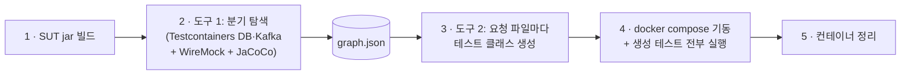
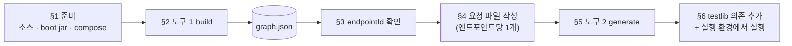

# 00 — 시작하기

처음 받은 사람이 이 순서대로 따라가면, 도구를 한 번 돌려보고(트랙 A) 자기 Spring 앱에
적용(트랙 B)할 수 있다. 개념·아키텍처를 먼저 읽고 싶으면 [01-overview](01-overview.md)와
[문서 지도](README.md)로 간다.

## 이 도구가 하는 일

도구 두 개로 나뉜다.

1. **graph-rag-builder**(도구 1)가 대상 앱(SUT, System Under Test)을 외부 프로세스로 띄워
   HTTP로 호출해 보면서, 코드의 사실(엔드포인트·분기·발행 SQL·외부 호출·DB 스키마)을
   `graph.json`으로 캡처한다.
2. **test-generator**(도구 2)가 그 `graph.json`과 요청 한 건(어느 엔드포인트의 테스트를
   원하는지)을 입력받아 RestAssured/JUnit5 테스트 코드를 만든다.

기본 경로에 LLM은 없다(선택 기능 `--llm-oracle` 제외). 같은 입력이면 같은 결과가 나온다. 자세한 구조는
[02-architecture](02-architecture.md).

## 사전 준비

- **JDK 17.** 빌드는 `gradle.properties`의 `org.gradle.java.home`에 적힌 JDK를 쓴다. 그 값이
  이 저장소를 만든 머신의 경로로 고정돼 있으니, 다른 머신에서는 그 줄을 자기 JDK 17 경로로
  바꾸거나 `JAVA_HOME`을 JDK 17로 지정한다. 셸의 기본 `java` 버전이 11이어도 빌드는 위 설정의
  JDK 17을 쓰므로 상관없다.
- **Docker(실행 중).** 도구 1은 Testcontainers로 DB·Kafka를, 생성된 테스트는 docker compose로
  실행 환경을 띄운다. 먼저 `docker info`가 성공하는지 확인한다.
- 인터넷 연결. 처음 실행 시 Postgres·Kafka 등 컨테이너 이미지를 내려받는다.

## 트랙 A — 데모 한 번 돌려보기

저장소에 들어 있는 샘플 앱(`samples/order-service`)으로 전 사이클을 돌린다.

```bash
./e2e/run-e2e.sh
```

이 스크립트가 하는 일(5단계):



1. 샘플 SUT와 보조 서비스의 jar를 빌드한다.
2. **도구 1**: SUT를 외부 프로세스로 띄우고(Testcontainers DB·Kafka + 분석용 WireMock +
   JaCoCo) 엔드포인트를 호출해 분기를 탐색하고 `graph.json`을 만든다.
3. **도구 2**: 엔드포인트별 요청 파일(`e2e/request-*.json`)마다 테스트 클래스를 생성한다.
4. docker compose로 실행 환경을 띄우고 생성된 테스트를 모두 실행한다.
5. 컨테이너를 정리한다.

성공하면 마지막 줄에 다음이 나온다.

```
✅ E2E PASS — tests=N skipped=0 failures=0 errors=0
```

산출물 위치:

| 경로 | 내용 |
|---|---|
| `e2e/out/graph/graph.json` | 도구 1이 캡처한 사실(엔드포인트·분기·SQL·스키마) |
| `e2e/out/graph/exploration-report.json` | 탐색 커버리지 리포트 |
| `e2e/out/generated/` | 도구 2가 생성한 테스트 `.java` |

## 트랙 B — 내 Spring 앱에 적용



자기 앱에는 도구 1·2를 직접 호출한다. 받는 방법은 두 가지이고 **둘 다 소스 빌드가 필요 없다**.
요구사항은 도구별로 다르다 — **test-generator는 Docker 불필요**, **graph-rag-builder는 Docker 데몬 필요**.

**A. Release zip (권장).** [Releases](https://github.com/baekchangjoon/graph-rag-test-generator/releases)에서
받아 압축을 푼다. `test-generator`는 **JRE 17만**, `graph-rag-builder`는 **JRE 17 + Docker**.

```bash
unzip test-generator-0.2.0.zip      # → test-generator-0.2.0/bin/test-generator
unzip graph-rag-builder-0.2.0.zip   # → graph-rag-builder-0.2.0/bin/graph-rag-builder
```

**B. 컨테이너 이미지 (Java 설치도 불필요).** GHCR에서 pull한다.

```bash
docker pull ghcr.io/baekchangjoon/test-generator:0.2.0
docker pull ghcr.io/baekchangjoon/graph-rag-builder:0.2.0
```

분석 대상 SUT의 **소스·boot jar·docker-compose**는 어느 방법이든 도구 입력으로 필요하다(§1).

아래 예시는 A(zip 런처) 기준이다. B(이미지)로 실행하려면 `bin/...`을 `docker run`으로 바꾼다:

```bash
# generator
docker run --rm -v "$PWD:/w" -w /w ghcr.io/baekchangjoon/test-generator:0.2.0 generate ...
# builder (Linux: docker.sock + --network host)
docker run --rm --network host -v /var/run/docker.sock:/var/run/docker.sock \
  -v "$SUT:/sut" -v "$PWD/out:/out" ghcr.io/baekchangjoon/graph-rag-builder:0.2.0 build ...
```

> 소스에서 빌드해 쓰려면(advanced): `./gradlew :graph-rag-builder:run --args="build ..."`,
> `./gradlew :test-generator:run --args="generate ..."`.

### 1. SUT 준비

- 운영과 같은 방식으로 만든 **boot jar** (`./gradlew bootJar` 또는 `mvn package`)
- **소스 디렉터리**(`src/main/java`). 리소스는 생략 시 소스 옆 `src/main/resources`로 가정한다(`--sut-resources`로 지정).
- 앱이 쓰는 DB를 정의한 **docker-compose.yml** (도구 1이 여기서 DB 종류를 감지한다)

> 이미 docker-compose로 앱 전체(앱 컨테이너 포함)를 띄워 쓰고 있다면, 그 compose를 그대로
> 써서 분석하는 **attach 모드**가 있다 — [26-attach-mode](26-attach-mode.md). 아래 기본
> 경로는 도구가 DB·Kafka를 Testcontainers로 직접 띄우는 분석 모드다.

### 2. 도구 1 — 사실 캡처

```bash
./graph-rag-builder-<v>/bin/graph-rag-builder build \
  --sut-src   <앱>/src/main/java \
  --sut-resources <앱>/src/main/resources \
  --sut-jar   <앱>/build/libs/<app>.jar \
  --sut-compose <앱>/docker-compose.yml \
  --out       ./out/graph
```

자주 쓰는 옵션:

| 옵션 | 언제 |
|---|---|
| `--auth-login-path /api/auth/login --auth-user U --auth-pass P` | 로그인 토큰이 필요한 보호된 엔드포인트가 있을 때 |
| `--external-stubs <dir> --sut-env KEY={{wiremock}}` | 앱이 외부 HTTP를 호출해서 스텁이 필요할 때 |
| `--with-redis` / `--with-kafka` | 앱이 Redis·Kafka를 쓸 때 (분석 모드) |
| `--kafka-bootstrap <host:port>` | ([attach 모드](26-attach-mode.md)) SUT가 outbound Kafka 메시지를 발행할 때. 요청별 trace-id로 produce 캡처([docs/06](06-test-environment.md) "Kafka outbound produce 캡처") |
| `--capture-services <a,b,c>` | ([attach 모드](26-attach-mode.md)) 멀티서비스 SUT의 여러 컨테이너 로그를 인터리브 tail해 비동기·서비스간 SQL 회수 ([docs/06](06-test-environment.md) "trace 모드") |
| `--sut-java-home <jdk>` | SUT를 다른 JDK로 띄워야 할 때 |
| `--trace-mode none` | SQL 캡처를 로그 파싱으로(기본은 OTEL DB span 기반 `otel`). OTEL 캡처가 안 되는 환경의 폴백 ([docs/06](06-test-environment.md) "trace 모드") |
| `--trace-mode sleuth` | 레거시 Java8+Sleuth SUT. B3 trace-id로 비동기·서비스간 SQL까지 로그 상관 ([docs/06](06-test-environment.md) "trace 모드"). 동작 데모: `samples/legacy-tram` |
| `--error-when-present <field>[,<field>...]` | 응답 바디에 지정 필드가 존재하면 HTTP 200이어도 FAILURE로 분류 (에러 엔벨로프 SUT). 동작 데모: `samples/error-envelope-service` ([docs/03](03-graph-rag-builder.md) "성공 오라클") |
| `--semantic-status-field <field>` | (기본 `errorCode`) 에러 엔벨로프의 의미론적 상태코드 필드 |
| `--error-detail-field <field>` | FAILURE 경로 테스트에 추가할 바디 어설션 대상 필드 (`--error-when-present` 와 함께 사용) |
| `--error-detail-contains <substr>` | `--error-detail-field` 와 함께 지정 시 `containsString` 어설션 생성 (`--error-detail-field` 없이는 효과 없음) |
| `--sut-env SERVER_ERROR_INCLUDE_MESSAGE=always` | (옵트인) 에러 응답에 `message`를 노출시켜, 실패 경로 테스트에 핸들러 소스 리터럴 기반 `message` 어설션을 합성 ([docs/04](04-test-generator.md) "Assertion 합성 규칙"). 생성 테스트를 돌리는 실행 환경 compose에도 **같은 env를 넣어야** 한다. ⚠️ 운영이 message를 숨긴다면 테스트 환경≠운영 환경 드리프트가 생기는 옵트인이다 |

끝나면 `./out/graph/graph.json`이 생긴다.

### 3. 테스트로 만들 엔드포인트 찾기

`graph.json`의 `endpoints` 목록에서 `id`를 확인한다. `id`는 **HTTP 메서드 + 경로**를
소문자로 바꾸고 영숫자가 아닌 구간을 `-`로 바꾼 값이다.

| 메서드 + 경로 | endpointId |
|---|---|
| `POST /api/orders` | `post-api-orders` |
| `GET /api/orders/{id}` | `get-api-orders-id` |

### 4. 요청 파일 작성

엔드포인트 하나당 JSON 한 개를 만든다.

```json
{
  "endpointId": "post-api-orders",
  "testClassName": "OrdersPostTest",
  "packageName": "io.graphrag.generated",
  "authMode": "REAL"
}
```

`authMode`는 보호된 엔드포인트면 `REAL`(토큰 발급 코드 포함), 인증이 꺼져 있으면 `DISABLED`.

### 5. 도구 2 — 테스트 생성

```bash
./test-generator-<v>/bin/test-generator generate \
  --request ./request-orders.json \
  --graph   ./out/graph \
  --out     ./out/generated
```

`./out/generated`에 테스트 `.java`와 `junit-platform.properties` 하나가 생긴다.

HTTP 엔드포인트 하나는 `@Test` 메소드 여러 개를 가진 테스트 클래스 **1개**로 나온다(예:
`OrdersPostTest.java` 안에 `happy()`, `s404_1()`, `s201_2()`). 각 `@Test`는 자기 `scope.testId()`로
격리돼 병렬 실행에 안전하다. 격리할 수 없는 시나리오(전파 정보 없음)는 클래스레벨
`@Execution(ExecutionMode.SAME_THREAD)`를 단 별도 `…Serial` 클래스(예: `OrdersPostTestSerial.java`)로
분리한다.

### 6. 생성된 테스트 실행

생성된 테스트는 `io.graphrag.testlib.*`를 import하므로, 컴파일하려면 Releases의
**`testlib-<v>.jar`** 를 자기 테스트 프로젝트의 의존성에 더한다(RestAssured·JUnit 등 표준 테스트
의존은 평소처럼 추가).

병렬 실행을 켜려면 산출물의 `junit-platform.properties`를 자기 테스트 프로젝트의
`src/test/resources/` 루트에 둔다. 이 파일은 `parallel.enabled=true`,
`config.strategy=dynamic`, `config.dynamic.factor=1`을 지정한다(이게 의도된 기본값이다). 이미
`junit-platform.properties`가 있으면 통째로 덮어쓰지 말고 `junit.jupiter.execution.parallel.*`
다섯 줄만 병합한다. (CLI는 내용이 다른 기존 파일을 덮어쓸 때 경고를 한 번 남긴다.)

실행하려면 운영과 같은 DBMS·WireMock·socket-mock·대시보드가 떠 있는 실행 환경이 필요하다. 그 구성은
[06-test-environment](06-test-environment.md)를 따른다. 데모(`e2e/`)의 `docker-compose.yml`과
`build.gradle.kts`가 그 구성의 동작 예시다.

## 막히면

| 증상 | 원인 / 해결 |
|---|---|
| `Cannot connect to the Docker daemon` | Docker가 실행 중이 아니다. `docker info`로 확인 후 Docker를 켠다. |
| `invalid Gradle JDK` / 17이 아님 | `gradle.properties`의 `org.gradle.java.home`이 이 머신에 없는 경로다. 자기 JDK 17 경로로 바꾸거나 `JAVA_HOME`을 JDK 17로 지정한다. |
| `address already in use` | 직전 실행의 컨테이너가 포트를 잡고 있다. `docker compose -f e2e/docker-compose.yml down -v` 후 다시 실행. (`run-e2e.sh`는 이를 자동 재시도한다.) |
| 이미지 pull 지연 | 처음 실행은 컨테이너 이미지를 내려받느라 느리다. 두 번째부터 빨라진다. |

## 다음 단계

- 전체 문서 지도: [docs/README.md](README.md)
- 용어 정의: [glossary.md](glossary.md)
- 입력 생성 원리: [23-input-generation-flow](23-input-generation-flow.md)
