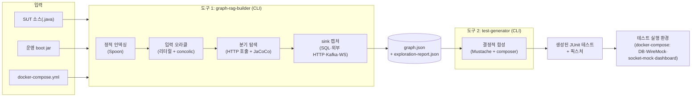

# 02 — 아키텍처

두 개의 **CLI 도구**(REST 서버 아님)와 런타임 보조 인프라로 구성된다. 도구 1이 SUT(System
Under Test — 분석 대상 애플리케이션)를 분석해 그래프(`graph.json`)를 만들고, 도구 2가 그
그래프로 JUnit 통합 테스트를 결정적으로 생성한다. 둘은 **그래프 포맷으로만 결합**되어
독립적으로 교체·실행 가능하다.



## 전체 흐름

```
============== BUILD PHASE (오프라인, 커밋 단위) — graph-rag-builder CLI ==============
[SUT 소스(.java) + 운영 boot jar + docker-compose]
  → 구조 인덱싱 (Spoon, noClasspath): 엔드포인트/바디shape/응답DTO/제약/Bean Validation
  → 입력 오라클 (InputOracle): StaticLiteralOracle(Spoon 리터럴) + ConcolicOracle(ASM 심볼릭 + Z3)
       → 필드별 입력 후보(소스에 없는 값도 도출: amount*3==21→7, code.length()==5→"xxxxx")
  → 분석 환경 (env): Testcontainers DB(compose에서 감지) + SUT를 외부 JVM 프로세스로 기동
                     + 임베디드 WireMock(외부 HTTP 캡처/스텁) + JaCoCo agent + OTEL agent(baggage)
  → 분기 탐색 (explore): HeuristicExplorer + CoverageGuidedFuzzer를 ExplorationOrchestrator가 구동.
       happy 입력 + (generic 변이 ⊕ 오라클 후보)를 SUT에 HTTP로 호출, 요청 단위 JaCoCo로
       arm-level 커버리지 관측, novelty 입력을 시드로 환류
  → sink 캡처 (capture/run): OTEL DB span에서 SQL+bind를 trace-id 귀속 캡처(기본; 로그 파싱 SqlLogParser는 폴백), WireMock 저널에서 외부 HTTP,
                              STOMP/WS 교환, @KafkaListener consumer 발행, 필요한 DB seed.
       Kafka consumer 루프는 HTTP 탐색보다 먼저 실행(consumer가 쓴 행을 read 엔드포인트가 관측).
       WS/Kafka 캡처도 각자 JaCoCo dump delta를 떠 전역 커버리지(runWideExec)에 병합되므로,
       exploration 커버리지는 HTTP뿐 아니라 consumer/WS 핸들러 실행까지 포함한다(지표는 전 루프 종료 후 1회 산출).
  → 그래프 저장 (store): JsonFileGraphStore(graph.json) + PartitionedGraphStore(패키지별 샤드)
              ↓
        [GRAPH ASSET = graph.json]
        - endpoints / exploredPaths(분기·status·바디·응답)
        - capturedSql / capturedHttpCalls / wsExchanges
        - tables(스키마) / requiredSeeds
        - exploration-report.json (handler 커버리지 + coveredAppBranches + coveredAppClasses
          [≥1 분기 covered된 app 클래스 — HTTP+consumer+WS 합산] + solverRelevantMissed)
====================================================================================

================ GENERATE PHASE — test-generator CLI ================
[GenerationRequest(JSON) + graph.json]
  → 그래프 로드 (client/FileGraphRagClient)
  → 결정적 합성 (Generator + compose/*): Mustache 골격 + 프로그램이 가변 슬롯 채움
       - origin 기반 값 치환, fixture(seed INSERT/cleanup), 외부 HTTP mock, 응답 assertion
              ↓
       생성된 JUnit 테스트(.java) + 픽스처  (LLM 없음, 결정적)
=====================================================================
```

LLM은 기본 경로의 어느 도구에도 없다(선택 기능 `--llm-oracle`을 켠 경우만 예외, 출력은 캐시로 고정). 외부 오케스트레이터(사람/LLM)가 도구 1 산출물을 보고 도구 2를 호출하는
것은 이 시스템 밖의 일이다.

## 컴포넌트 책임 경계

### 도구 1: graph-rag-builder  (`io.graphrag.builder.*`)
- LLM 없음. SUT를 **외부 프로세스로 실행**하며 HTTP로 두드려 사실을 관측·캡처.
- 패키지: `index`(Spoon 정적 인덱싱) · `oracle`(InputOracle: static-literal + concolic ASM/Z3) ·
  `explore`(엔진+오케스트레이터+변이) · `env`(SUT 프로세스/Testcontainers/compose/WireMock) ·
  `coverage`(JaCoCo arm-level + CoverageFingerprint + OTEL agent) · `capture`(SqlCaptureBackend: OtelSpanCapture 기본 + LogParserCapture 폴백, OtlpTraceReceiver) ·
  `run`(EndpointExplorationRunner) · `store`(그래프 저장) · `schema` · `cli`.
- 산출물: `graph.json`(+ 파티션 샤드) + `exploration-report.json`. 증분 빌드 지원
  (`--incremental-base`/`--changed-files`).
- 자세히: `docs/03-graph-rag-builder.md`, `docs/23-input-generation-flow.md`,
  `docs/24-input-discovery-internals.md`.

### 도구 2: test-generator  (`io.graphrag.generator.*`)
- LLM 없음. 그래프 사실 → 결정적 합성. 큰 골격은 Mustache 템플릿(`test-class.mustache`,
  `ws-test-class.mustache`), 가변 길이 슬롯은 프로그램(`compose/FixtureComposer`,
  `HttpMockComposer`)이 채움 (방식 C).
- 패키지: `generator`(Generator) · `compose` · `client`(그래프 로드) · `cli`.
- 자세히: `docs/04-test-generator.md`, `docs/decisions/generator-composition-rules.md`.

### testlib  (`io.graphrag.testlib.*`)
- 생성된 테스트가 의존하는 helper. SPI + 어댑터로 mock/auth 백엔드 교체. TestScope 단위 unique
  testId + cleanup. 대시보드 이벤트 발행(fire-and-forget). 자세히: `docs/07-mock-infrastructure.md`.

### test-state-dashboard (standalone)
- testlib 이벤트 수신, 메모리 상태 유지, TTL 기반 누수 감지(마킹). REST(`POST /events`, `GET /active`,
  `GET /leaked`, `GET /test/{id}`). 자세히: `docs/08-dashboard.md`.

### socket-mock-server (standalone)
- TCP byte 패턴 매칭 + 응답 시퀀스, admin REST로 시나리오 등록. 자세히: `docs/07-mock-infrastructure.md`.

## 모듈 구성 (settings.gradle.kts)

```
repo/
├── shared-model/                # 그래프/이벤트 도메인 레코드 (두 도구 공용)
├── graph-rag-builder/           # 도구 1 (CLI: BuilderCli)
│   └── io/graphrag/builder/{index,oracle,explore,env,coverage,capture,run,store,schema,cli}
├── test-generator/              # 도구 2 (CLI: GeneratorCli)
│   └── io/graphrag/generator/{,compose,client,cli}
├── testlib/                     # 생성 테스트 런타임 helper (SPI + 어댑터)
├── test-state-dashboard/        # standalone 누수 감지 서비스
├── socket-mock-server/          # standalone TCP mock
├── samples/order-service/       # 기본 샘플 SUT (Spring Boot 3, JPA+MyBatis, 자기검증용 시나리오 포함)
├── samples/gateway-service/     # Spring Cloud Gateway 프록시 샘플 SUT (e2e/run-gateway-e2e.sh 대상)
├── samples/error-envelope-service/ # HTTP 200 + 에러 엔벨로프 샘플 SUT (성공 오라클 검증용)
└── e2e/                         # 전 사이클 e2e (build → generate → compose up → 생성 테스트 실행)
```

`samples/legacy-tram/`은 저장소에 있지만 **루트 Gradle 빌드(settings.gradle.kts)에 포함되지
않는다** — Java 8 + Spring Boot 2.7/Sleuth 멀티서비스 샘플이라 자체 docker-compose와
`gradle:7.6-jdk8` 컨테이너 빌드로만 동작한다(`e2e/run-legacy-tram-sleuth-e2e.sh`,
`e2e/run-attach-sleuth-egress-e2e.sh` 대상).

(주의: `oracle`의 입력 발견을 위해 빌더는 Spoon 외에 **ASM + Z3(`tools.aqua:z3-turnkey`)**도 의존한다 —
`docs/decisions/builder-spoon-only.md` 참조.)

## 데이터 흐름 (build phase 상세)

```
SUT 소스 + boot jar + compose
   ↓ index (Spoon)         엔드포인트/바디shape/제약 인벤토리
   ↓ oracle                필드별 입력 후보 (static literal ∪ concolic ASM+Z3)
   ↓ env                   compose에서 DB 감지 → Testcontainers, SUT를 외부 JVM으로 기동(env 주입),
                           JaCoCo/OTEL agent 부착, WireMock 기동
   ↓ explore (per endpoint) happy 합성(POST→SampleInputSynthesizer, GET→ReadInputSynthesizer)
                           + InputMutator.forTarget(generic ⊕ constraintDirected) 를 HTTP로 호출,
                           요청 단위 JaCoCo dump를 누적 병합(arm-level), novelty 시드 환류,
                           path 식별 = status + probe 지문
   ↓ capture              SQL=OTEL DB span trace-id 귀속(기본; 로그 파싱 폴백), 외부 HTTP=WireMock 저널, WS, seed
   ↓ store                graph.json + 파티션 샤드 + exploration-report.json
```

## 실행 모델
- 두 도구 모두 **CLI**(서버 없음). 도구 2는 stateless — 동일 그래프로 병렬 호출 안전.
- 분석 환경(도구 1)과 생성 테스트가 실행되는 환경은 **별개**다(아래).

## 환경 분리

두 환경을 혼동하지 말 것 — 도구 1이 *관측*하는 환경과 도구 2 산출물이 *실행*되는 환경은 다르다.

| 환경 | 누가 띄우나 | 구성 | 자세히 |
|---|---|---|---|
| **분석 환경** (도구 1) | 빌더가 직접 | SUT를 **운영 boot jar 그대로 외부 프로세스**로 실행(in-process Spring TestContext 아님), env로 DB/외부URL/로깅 주입. Testcontainers DB + 임베디드 WireMock + JaCoCo/OTEL agent | `docs/decisions/builder-analysis-environment.md` |
| **테스트 실행 환경** (생성된 테스트) | docker-compose | 운영 동일 DBMS + WireMock + socket-mock + dashboard. 테스트는 RestAssured로 실행 | `docs/06-test-environment.md` |
