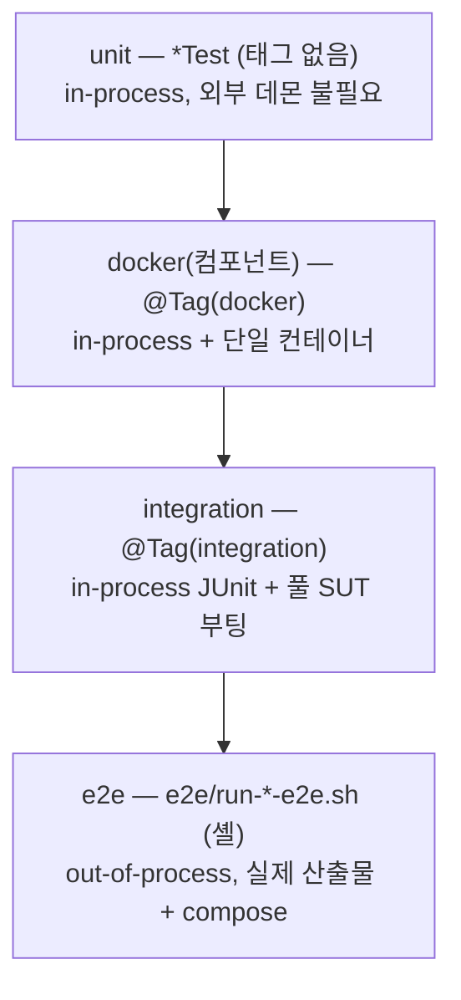

# 05 — 테스트 분류 체계 (taxonomy)

이 레포 테스트의 **레이어 / 프로세스 / 런타임(docker)** 세 축을 직교하게 정의하고, 각 축을
*하나의* 메커니즘(이름 접미사 · `@Tag` · CI 샤드)으로 표현한다. 이름·태그·CI 샤드가 항상
같은 분류를 가리키게 하는 것이 목적이다. (배경/근거: `docs/superpowers/design/2026-06-19-test-taxonomy-design.md`)

이 문서는 **개수를 열거하지 않는다** — 어떤 테스트가 어느 분류에 속하는지는 아래
"분류 현황 확인" 절의 명령으로 저장소에서 직접 확인한다. 개수는 커밋마다 변해서 문서에
적어두는 순간 낡는다.

## 네 계층 한눈에



(화살표 = 무거워지는 순서. 위로 갈수록 빠르고 자주 돈다.)

| 계층 | 무엇을 검증 | 표현 | 실행 필터 |
|---|---|---|---|
| **unit** | in-process 로직. 외부 데몬 불필요(또는 in-process WireMock/EmbeddedKafka/Spring slice) | `*Test`, 태그 없음 | `check -PexcludeTags=integration,docker` |
| **docker(컴포넌트)** | in-process지만 단일 컨테이너(Postgres/MySQL/Kafka)를 띄우는 narrow 테스트. 풀 SUT는 안 띄움 | `@Tag("docker")` | `test -PincludeTags=docker` |
| **integration** | in-process JUnit이 **실제 SUT를 부팅**(Testcontainers DB + SUT 프로세스). `@EnabledIfSystemProperty(sut.jar)`로 게이팅 | `@Tag("integration")` | `-PincludeTags=integration` (CI는 `--tests` 열거 — 아래 참조) |
| **e2e(셸)** | out-of-process 전 사이클. 실제 빌드 산출물 jar/이미지를 프로세스로 실행 | `e2e/run-*-e2e.sh` | CI job 또는 수동 |

### 세 축

| 축 | 값 | 결정 주체 |
|---|---|---|
| **레이어** | unit / docker / integration / e2e | `@Tag`(JUnit) 또는 셸 스크립트 여부 |
| **프로세스** | in-process / out-of-process | JUnit(전부 in-process) vs 셸 e2e(out-of-process) |
| **런타임** | host-only / docker-required | `@Tag("docker")` / `@Tag("integration")`(풀 SUT라 Docker 필요) |

## 이름 규칙: `*IntegrationTest` · `*E2E` · `run-*-e2e.sh`

레이어를 정하는 것은 **태그**이고, 이름 접미사는 테스트의 **성격**을 말한다.

| 접미사 | 성격 | 프로세스 |
|---|---|---|
| `*Test` | 일반 테스트 | in-process JUnit |
| `*IntegrationTest` | 풀 SUT를 부팅하는 통합 테스트 | in-process JUnit |
| `*E2E` (JUnit 클래스) | 요구사항 단위 **수용(acceptance) 테스트** — CLI 서브커맨드·파이프라인 조각을 끝까지 구동해 검증. 레이어는 이름이 아니라 태그가 정한다(풀 SUT를 띄우면 `@Tag("integration")`, 단일 컨테이너면 `@Tag("docker")`, 데몬 불필요면 태그 없음) | in-process JUnit |
| `run-*-e2e.sh` (셸) | out-of-process 전 사이클 — 실제 산출물 jar/이미지 + docker-compose를 프로세스로 실행 | out-of-process |

> **규칙 개정 이력**: 초기 규칙은 JUnit 클래스에 `E2e` 접미사를 금지했다(e2e = 셸 전용).
> 이후 요구사항별 수용 테스트를 `*E2E` JUnit 클래스로 두고 CI가 `-PincludeTags=integration`
> 샤드에서 실행하는 관행이 정착되어, 현재 규칙은 위와 같이 **셸 = out-of-process 전 사이클,
> JUnit `*E2E` = in-process 수용 테스트**로 구분한다.

## 규칙 (불변식)

- **R1.** `@Tag("integration")` ⟺ 풀 SUT 부팅. 이름은 `*IntegrationTest` 또는 수용 테스트면
  `*E2E`를 쓴다.
- **R2.** 셸 `run-*-e2e.sh`만 out-of-process다. JUnit `*E2E` 클래스는 in-process 수용
  테스트이며 런타임 요구에 맞는 태그를 반드시 단다(위 표).
- **R3.** `@Tag("docker")` = 컨테이너 필요 + 풀-SUT 아님. unit 샤드에서 제외, docker 샤드에서 실행.
- **R4.** 태그 없는 `*Test` = host-only in-process unit. Docker 데몬 없이 통과해야 함.
- **R5.** CI의 `it-*` 샤드는 `--tests`로 클래스를 **명시 열거**한다. 새 integration 클래스는
  `.github/workflows/ci.yml`의 한 샤드에 추가해야 CI에서 실행된다 — 목록에 없으면 어느
  샤드에서도 돌지 않는다(ci.yml 주석에도 명시).

## 샤드 ↔ 태그 ↔ 레이어 매트릭스

`.github/workflows/ci.yml` 기준. 이 표가 낡았는지 의심되면 ci.yml의 `jobs:`가 단일 출처다.

| CI 샤드/job | gradle 필터 / 스크립트 | 레이어 | 프로세스 | docker |
|---|---|---|---|---|
| `check (unit)` | `check -PexcludeTags=integration,docker` | unit | in-process | 불필요 |
| `check (docker)` | `test -PincludeTags=docker` | docker(컴포넌트) | in-process | 단일 컨테이너 |
| `check (it-cli-light)` / `(it-cli-otel)` / `(it-rest)` / `(it-triple)` | `-PincludeTags=integration` + `--tests` 클래스 열거 | integration | in-process | 풀 SUT |
| `e2e` | 셸 `run-e2e.sh` | e2e | out-of-process | compose |
| `gateway-e2e` | 셸 `run-gateway-e2e.sh` | e2e | out-of-process | compose(gateway + WireMock) |
| `dind-builder-e2e` | 셸 `run-dind-builder-e2e.sh` | e2e | out-of-process | 하네스가 컨테이너 안(DinD) |
| `service-image-boot-e2e` | 셸 `run-service-image-boot-e2e.sh` | e2e | out-of-process | 산출물 이미지 부팅 |
| `coverage` | `jacocoAggregatedReport -PexcludeTags=integration` | (측정 — 테스트 샤드 아님) | in-process | 불필요 |

> `dind-builder-e2e`/`service-image-boot-e2e`는 `pull_request` 또는 `v*` 태그에서만 실행된다
> (`if:` 조건). `coverage`는 PR 전용·정보성이다(아래 "커버리지").
> 멀티 태그 필터(`integration,docker`)는 루트 `build.gradle.kts`가 콤마로 split해 JUnit5에 넘긴다.

## "docker"의 세 의미 (job 이름이 구분)

- **(a) 호스트 테스트가 Testcontainers로 docker를 *사용*** — `check (docker)` 샤드(테스트 JVM은 호스트).
- **(b) 산출물이 docker 이미지*로* 패키징됨** — `service-image-boot-e2e`.
- **(c) 테스트 하네스 *자체가* docker 안에서 돎(DinD)** — `dind-builder-e2e`.

## e2e 셸 스크립트 전수

`e2e/run-*.sh` 전체. "CI"는 위 매트릭스의 job과 연결된 것, 나머지는 수동 실행이다.
(attach 계열의 동시 실행 금지 제약은 [docs/26](26-attach-mode.md) "attach 계열 e2e는 순차 실행" 참조.)

| 스크립트 | 무엇을 검증 | 실행 |
|---|---|---|
| `run-e2e.sh` | 전 사이클: build(분기 탐색) → generate → compose 기동 → 생성 테스트 실행 | CI `e2e` |
| `run-gateway-e2e.sh` | Spring Cloud Gateway 프록시 스모크 — gateway-service + 다운스트림 WireMock 스텁 풀사이클 | CI `gateway-e2e` |
| `run-dind-builder-e2e.sh` | builder Docker 이미지가 컨테이너 안(DinD)에서 Testcontainers + SUT로 graph.json 생성 (Linux 전용) | CI `dind-builder-e2e` (PR/`v*` 태그) |
| `run-service-image-boot-e2e.sh` | 실행 환경 서비스 이미지(test-state-dashboard, socket-mock-server)가 prebuilt 이미지로 부팅·응답 | CI `service-image-boot-e2e` (PR/`v*` 태그) |
| `run-attach-e2e.sh` | attach 모드 기본 — 사용자 compose + override로 SUT 기동, 인증 포함 깊은 탐색의 분기/SQL 임계 검증 | 수동 |
| `run-attach-otel-e2e.sh` | attach + OTEL — 호스트 OTLP 리시버로 SQL이 trace-id 귀속 캡처되는지(로그 폴백 아님) | 수동 |
| `run-attach-ext-http-e2e.sh` | attach에서 SUT의 외부 HTTP 호출이 capture WireMock으로 캡처되는지 | 수동 |
| `run-attach-multiroot-e2e.sh` | attach + 멀티 루트 `--sut-src` — 선택 루트만 담은 부분 그래프 검증 | 수동 |
| `run-attach-sleuth-egress-e2e.sh` | attach + sleuth 모드 — Zipkin 리시버로 egress(외부 HTTP) 발견 (legacy-tram 대상) | 수동 |
| `run-legacy-tram-sleuth-e2e.sh` | B3 trace-id가 A→B→Tram/Kafka/CDC→C로 전파 + sleuth SQL 캡처 + CDC 노이즈 제외 | 수동 |
| `run-auth-headers-e2e.sh` | 커스텀 요청 헤더(X-AuthorizationTime) 강제 SUT의 빌더 탐색 + 생성 테스트 재실행 | 수동 |
| `run-error-envelope-e2e.sh` | 에러 엔벨로프 SUT — HTTP 200 + 에러 필드를 FAILURE로 분류하고 에러 계약 어설션 생성 | 수동 |
| `run-endpoint-glob-e2e.sh` | `--endpoint` glob이 탐색만 좁히고 정적 엔드포인트 목록은 풀 유지 | 수동 |
| `run-dist-e2e.sh` | prebuilt distZip 런처만으로 builder→generator→생성 테스트 컴파일 | 수동 |
| `run-docker-e2e.sh` | generator Docker 이미지가 호스트 Java 없이 graph.json → 테스트 .java 생성 | 수동 |

## 커버리지 (자체 테스트)

프로젝트 *자체* 테스트가 제품 코드를 얼마나 덮는지 측정한다. (도구가 측정하는 *SUT* 분기
커버리지인 `docs/coverage-progress.md`와는 별개다.)

- **집계 태스크:** 루트 `./gradlew jacocoAggregatedReport`. 제품 모듈(`shared-model`,
  `testlib`, `test-state-dashboard`, `socket-mock-server`, `graph-rag-builder`,
  `test-generator`)의 `test`를 jacoco로 돌려 하나로 합친다.
  산출물: `build/reports/jacoco/jacocoAggregatedReport/`(XML + HTML).
- **CI 측정 범위 = unit + docker** (`-PexcludeTags=integration`). integration(풀-SUT 부팅)은
  단일 러너에서 직렬로 돌리면 무겁고 flaky해서 제외하고, e2e(out-of-process)는 별도
  프로세스라 애초에 잡히지 않는다. 즉 이 수치는 **in-process unit+컴포넌트 하한**이다(코멘트에
  범위 라벨 표기). 더 정확한 전체 수치는 `check` 샤드가 만든 `test.exec`를 아티팩트로 합치는
  방식으로 확장 가능(현재 범위 밖).
- **제외 모듈:** `samples`(fixture SUT)·`e2e`(하네스)는 집계 대상이 아니다.
- **CI:** `coverage` job(PR 전용, 정보성·non-blocking)이 집계를 실행해 (a) HTML 리포트를
  `coverage-html` 아티팩트로 업로드하고 (b) 전체 커버리지 표(+범위 라벨)를 PR 코멘트(마커 갱신)와
  job summary에 게시한다. 임계값 게이트나 `release.needs` 의존은 두지 않는다. 집계 XML이
  비면(exec 미병합) 그럴듯한 0%를 게시하지 않고 실패한다.
- 구현 메모: `jacoco-report-aggregation` 플러그인은 Spring Boot 모듈의 BOM 버전을 루트에서
  해석하려다 실패해, exec+classes+sources만 읽는 수동 `JacocoReport`를 쓴다. 코멘트 표는
  `.github/scripts/coverage_summary.py`가 집계 XML에서 생성한다.

## 분류 현황 확인 (개수 대신 명령)

현재 어떤 테스트가 어느 분류인지는 저장소에서 직접 뽑는다.

```bash
# integration 태그 클래스 (풀 SUT 부팅)
grep -rl '@Tag("integration")' */src/test samples/*/src/test

# docker 태그 클래스 (단일 컨테이너 컴포넌트)
grep -rl '@Tag("docker")' */src/test samples/*/src/test

# JUnit 수용 테스트 (*E2E) 클래스
find . -name '*E2E.java' -path '*/src/test/*'

# e2e 셸 스크립트 전수
ls e2e/run-*.sh
```

- CI에서 실제로 도는 integration 클래스는 `.github/workflows/ci.yml`의 `it-*` 샤드 `--tests`
  목록이 단일 출처다(R5). 태그는 있는데 어느 샤드 목록에도 없는 클래스는 CI에서 돌지 않으므로,
  위 grep 결과와 ci.yml을 대조하면 드리프트를 찾을 수 있다.
- 이름 규칙 드리프트(예: `@Tag` 값과 접미사 불일치)도 같은 방법으로 대조한다 — 발견하면 규칙에
  맞추거나 규칙을 개정한다.
