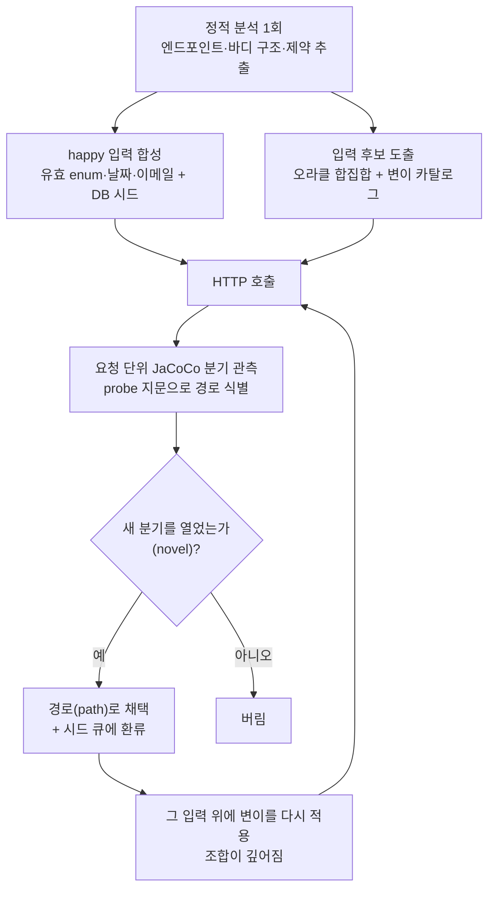

# 입력 생성 개요 — 도구가 분기를 여는 입력을 만드는 방법

graph-rag-builder(도구 1)는 [SUT](glossary.md)(테스트 대상 앱)를 외부 프로세스로 띄우고,
입력을 바꿔 가며 HTTP로 호출해 코드의 여러 분기를 실행해 본다. 이 문서는 그 입력이
**어디서 나오고, 어떻게 점점 깊은 분기까지 도달하는지**를 설명한다.

구현 세부(오라클 내부 구조, 콘콜릭 이론, 정적 분석의 한계 목록)는
[docs/24-input-discovery-internals.md](24-input-discovery-internals.md)에 있다.

## 왜 정적 분석만으로는 안 되나

정적 분석(코드를 실행하지 않고 소스·바이트코드를 읽는 것)만으로 입력을 만들 수 없는
이유는 두 가지다. 첫째, 소스를 읽으면 `if (amount * 2 == 84)`의 `84`와 `2`는 보이지만,
이 분기를 여는 값 `42`는 소스 어디에도 없다 — 리터럴을 *읽는* 것과 조건을 만족하는 값을
*유도*하는 것은 다른 일이다. 둘째, 무엇이 실행되는지 자체가 런타임에 정해지는 코드가
있다 — Spring Data가 메서드 이름에서 합성하는 SQL, 인터페이스에 주입되는 구현체,
리플렉션 dispatch 등. 그래서 이 도구는 **값 유도는 입력 오라클에**, **실제 동작 확인은
SUT를 띄운 런타임 관측에** 맡긴다.

## 전체 파이프라인 한눈에



핵심은 오른쪽 아래의 되먹임이다. **어떤 입력이 새 분기를 열었다(novel)고 판정되는 순간이
곧 다음 입력 조합을 만드는 트리거**다. novel하지 않은 입력은 버려지고, novel한 입력만
시드가 되어 그 위에 다시 변이가 쌓인다. 모든 단계는 결정적이다 — Random·시간을 쓰지
않으므로 같은 코드에서 항상 같은 입력이 나온다.

## 출발점: happy 입력 하나를 합성한다

탐색은 엔드포인트마다 **유효한 입력 한 벌**(happy 입력)에서 시작한다. 이게 있어야
역직렬화·기본 검증을 통과해 깊은 가드에 도달할 수 있다.

- enum 필드는 선언된 첫 상수, `LocalDate`는 ISO 날짜, 이름이 `*email`인 필드는 유효
  이메일, boolean 파라미터는 `"true"`로 채운다.
- `GET`이나 path 파라미터가 있는 엔드포인트(`/{id}` 형태)는 DB에 리소스 행(시드)을 먼저
  넣고, 그 유효 PK로 경로를 채운다.
- 수정·삭제 엔드포인트(`PUT`/`DELETE /{id}`)는 요청마다 시드를 새로 복원해, 각 응답이
  (시드, 요청)만으로 재현되게 한다.

## 입력 후보를 만드는 오라클 — 합집합으로 쓴다

"어떤 값을 넣어야 이 분기가 열리나"에 답하는 구성요소가
[InputOracle](glossary.md)이다. 교체 가능하며, 현재 구현들의 후보를 **합집합(merge)** 으로
합쳐 쓴다.

| 오라클 | 원리 | 도출 예 | 한계 |
|---|---|---|---|
| `StaticLiteralOracle` | Spoon으로 소스를 읽어 리터럴 비교·문자열 동치(`==`/`equals`)의 값을 추출, 경계값(`L-1, L, L+1`)으로 펼침 | `if (nights > 30)` → `29, 30, 31` | 소스에 적힌 값만. 계산·파생 값은 못 만든다 |
| `ConcolicOracle` | ASM으로 바이트코드를 심볼릭 스캔하고, 분기 경계식을 Z3(제약식을 만족하는 값을 찾는 SMT 솔버)로 풀어 **소스에 없는 값**을 도출 | `score*2==84` → `42`, `code.length()==5` → `"xxxxx"` | 메서드 내부, 최대 2필드 선형식까지. 비선형·3변수 이상은 보류 |
| `LlmOracle` (선택, `--llm-oracle`) | LLM이 엄격 검증 필드에 도메인에 맞는 문자열을 생성. 출력은 캐시에 커밋해 재실행은 캐시 우선·오프라인 | `@Pattern("[A-Z]{4}-\d{4}")` + `startsWith("GOLD")` → `"GOLD-1234"` | 문자열 값 후보만 더한다(구조는 안 바꿈). 내부 SUT 전용 권고 |

## 변이 카탈로그 — 후보를 입력에 적용하는 규칙

오라클과 정적 분석이 낸 후보들은 "happy 입력의 한 곳(또는 여러 곳)을 바꾸는 변형(mutation)
목록"으로 바뀐다. 고신호 변이를 앞에 두어, 예산이 적을 때 일반 변이가 의미 있는 변이를
밀어내지 않게 한다.

| 변이 계열 | 무엇을 바꾸나 | 예 |
|---|---|---|
| constraint-directed | Bean Validation·비교식의 경계값 | `@Min(1)` → `0`/`1`, `nights` → `31` |
| enum values | enum 필드에 선언된 각 상수 | `tier` → `VIP` |
| joint | 한 메서드의 `&&` 다필드 가드의 조건들을 **동시에** 만족값으로 | `{tier: "VIP", loyaltyPoints: 499}` |
| first-order (generic) | 필드별 일반 경계 | `remove`/`null`/`zero`/`negative`/`large`/`empty` |

## 두 탐색 엔진 — 조합이 깊어지는 방식

두 엔진이 같은 변이 카탈로그를 쓰되, 적용 대상이 다르다.

| 엔진 | 변이 적용 대상 | 여는 것 |
|---|---|---|
| `HeuristicExplorer` (1차) | happy 입력 하나에 각 변이를 1회씩 | 한 필드만 바꾸면 열리는 분기 |
| `CoverageGuidedFuzzer` (2차 이상) | novel 입력(시드) 위에 같은 변이를 **다시** 적용 | 여러 필드가 동시에 맞아야 열리는 깊은 분기 |

깊은 분기가 시드 누적으로 열리는 예: 가드가 순차라서 `roomNumber`가 유효해야만 `tier`
가드에 도달하는 코드가 있다고 하자. 1차에서 `roomNumber`를 유효 경계값으로 바꾼 입력이
새 분기를 열어 시드가 되고, 2차에서 그 시드 위에 `tier=VIP` 변이를 얹으면 두 조건이
동시에 성립해 깊은 가드의 true-arm에 도달한다. 새 분기가 이어서 나오지 않으면(포화)
그 엔드포인트 탐색을 끝낸다.

## Stage 0~4 — 단계별로 여는 분기 종류

happy 합성과 변이 파이프라인 위에, 더 흔한 분기 종류를 여는 단계들이 쌓여 있다.

| Stage | 여는 것 | 입력·시드 예 | 대응 가드 예 |
|---|---|---|---|
| 0 | 역직렬화·기본 검증을 통과해 서비스 로직에 진입 | enum 첫 상수, ISO 날짜, 유효 이메일 | `@Valid` 통과, `tier == null` 거부를 피함 |
| 1/2 | enum 값 분기와 다필드 `&&` 가드 | `tier=VIP`, `{tier: VIP, loyaltyPoints: 499}` 동시 세팅 | `tier==VIP && loyaltyPoints<500` |
| 3 | by-id 엔드포인트(`/{id}`) 진입 | 유효 PK + 리소스 시드 행, 가드 유래 enum 컬럼 값 | `GET /{id}`가 404·500 없이 조회 |
| 3b | 수정·삭제 by-id의 재현성 | 요청마다 시드 리셋 | `PUT/DELETE /{id}`가 상태 누적 없이 동작 |
| 4 | 저장된 행의 **상태**에 갈리는 가드의 여러 arm | 과거 날짜 시드 변종, 다른 enum 상태의 시드 변종 | stale 검사 404, 상태머신 전이 409/410 |

여기서 arm(분기 갈래)이란 `if (cond)`의 참일 때 실행되는 true-arm과 거짓일 때의
false-arm이다. 한 입력은 보통 한 arm만 지나가므로, 반대 arm을 열려면 다른 입력이나 다른
시드 데이터가 따로 필요하다 — 위 단계들이 그 "다른 입력·시드"를 만드는 방법이다.

## 예제로 따라가기 — `POST /api/bookings`

order-service의 Booking 엔드포인트로 위 흐름을 처음부터 끝까지 따라가 본다:

```java
record CreateBookingRequest(String customerEmail, Integer nights, Integer loyaltyPoints,
                            BookingTier tier, LocalDate checkInDate) {}   // tier = {BASIC, VIP}

if (nights < 1 || nights > 30)              throw 422;   // ① 단일 숫자 범위
if (tier == null)                           throw 422;   // ②
if (tier == VIP && loyaltyPoints < 500)     throw 422;   // ③ 다필드 가드
if (!EMAIL.matches(customerEmail))          throw 422;   // ④ 이메일
if (!checkInDate.isAfter(now()))            throw 422;   // ⑤ 날짜
// 모두 통과 → 201 created
```

1. **happy 합성(Stage 0)**: `{customerEmail: "probe@example.com", nights: 1,
   loyaltyPoints: 1, tier: "BASIC", checkInDate: "2999-01-01"}` → 201. 이게 안 되면
   ④·⑤에서 막혀 ③ 같은 깊은 가드에 도달조차 못 한다.
2. **후보 도출**: 비교식 경계에서 `nights ∈ {0, 1, 2, 29, 30, 31}`, enum 상수에서
   `tier ∈ {BASIC, VIP}`, conjunction 추출에서 `{tier==VIP, loyaltyPoints<500}` 묶음.
3. **1차 탐색**: happy 입력에 변이를 하나씩 적용한다. `nights=31` → 422(①),
   `tier=VIP` → 422(③ — happy의 loyaltyPoints=1이 이미 500 미만), 잘못된 이메일 →
   422(④), 변이 없는 happy → 201. 요청마다 어떤 분기가 열렸는지 관측한다.
4. **2차 탐색**: 새 분기를 연 입력들 위에 변이를 다시 쌓아, 여러 필드가 동시에 맞아야
   열리는 조합까지 도달한다. 새 분기가 이어서 나오지 않으면 종료한다.

결과적으로 ①~⑤ 각 가드의 통과/거부 양쪽을 실행한 입력들이 경로로 남고, 각 경로가
테스트 하나가 된다.

## "seed"는 두 가지다

이름이 같아 헷갈리기 쉬운 두 개념을 구분한다.

| 종류 | 무엇 | 쓰임 |
|---|---|---|
| DB seed | 분석 DB에 미리 넣는 **행** | `GET/PUT/DELETE /{id}`가 읽고 수정할 데이터 |
| explorer seed | **새 분기를 연 입력**(요청 body) | 다음 변이를 쌓는 발판 |

## 산출물

- 발견된 경로마다 `ExploredPath` — 입력 body, 응답 status, 캡처된 SQL·외부 HTTP 호출,
  지나간 분기 목록, 필요한 DB 시드. test-generator(도구 2)가 이것으로 테스트를 만든다.
- `exploration-report.json` — 엔드포인트별 covered/total 분기, 미도달 분기 목록. 분기가
  미도달로 남는 이유와 대처는
  [docs/24-input-discovery-internals.md](24-input-discovery-internals.md)의
  "정적 발견의 한계" 절을 참고.
