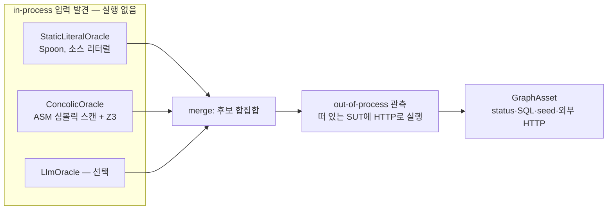
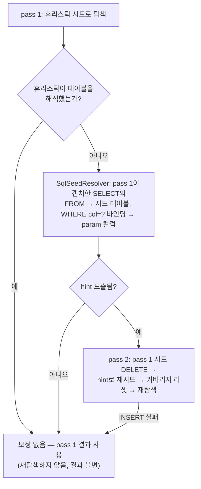

# 입력 발견 내부 — 이론, 오라클 구현, 탐색 엔진, 정적 한계

이 문서는 입력 생성의 **구현·이론 심화 편**이다. 사용자용 개요는
[docs/23-input-generation-flow.md](23-input-generation-flow.md)를 먼저 읽는 것을 권장한다.
기존 세 문서 — 정적 발견의 한계(구 docs/22), 탐색 백엔드와 입력 오라클(구 docs/24),
입력 발견 이론(구 docs/25) — 를 여기로 통합했다.

절 구성:

1. [이론 배경 — 분기를 여는 입력을 찾는 기법들](#1-이론-배경--분기를-여는-입력을-찾는-기법들)
2. [아키텍처 결정 — out-of-process 관측 + in-process 입력 오라클](#2-아키텍처-결정--out-of-process-관측--in-process-입력-오라클)
3. [InputOracle 구현](#3-inputoracle-구현)
4. [탐색 엔진 구현](#4-탐색-엔진-구현)
5. [happy 합성과 시드](#5-happy-합성과-시드)
6. [관측 대상 확장 — HTTP 밖 진입점과 부정 경로](#6-관측-대상-확장--http-밖-진입점과-부정-경로)
7. [정적 발견의 한계 — 런타임 관측으로 메우는 패턴들](#7-정적-발견의-한계--런타임-관측으로-메우는-패턴들)
8. [LLM 직접 생성과의 비교](#8-llm-직접-생성과의-비교)
9. [남은 한계와 범위 밖](#9-남은-한계와-범위-밖)

---

## 1. 이론 배경 — 분기를 여는 입력을 찾는 기법들

풀려는 문제는 한 줄이다:

> SUT의 어떤 분기 `if (조건)`을 **참/거짓 양쪽으로** 실행시키는 **입력값**을 자동으로 찾고 싶다.

```java
String classify(int amount) {
    if (amount * 2 == 84) return "lucky";   // 이 분기를 열려면 amount=42가 필요하다
    return "base";
}
```

`amount=42`는 소스 어디에도 없다(`84`와 `2`만 있다). 무작위로 던지면 거의 못 맞춘다.
이 값을 알아내는 기법들을 비교하면:

| 기법 | 한 줄 정의 | 강점 | 한계 |
|---|---|---|---|
| 정적 분석 | 실행하지 않고 소스(AST — 우리는 Spoon)나 바이트코드(우리는 ASM)를 읽는다 | 빠르고 환경(DB·네트워크) 불필요, 결정적 | 리터럴을 *읽을* 뿐 조건을 만족하는 값을 *유도*하지 못함. 런타임에만 정해지는 값·리플렉션·동적 dispatch를 못 봄 |
| 심볼릭 실행 | 입력을 기호 `α`로 두고 실행하며 경로 조건(`2·α == 84`)을 수식으로 쌓아 SMT로 푼다 | 파생 값도 정확히 유도, 도달 불가 경로 증명 가능 | 경로 폭발(분기 N개 → 경로 2^N), 환경(native·JDK·DB) 모델링 필요, 도구가 무겁고 JVM 버전을 못 따라감(대표 도구 JPF/SPF는 Java 8–11) |
| 콘콜릭 실행 | 실제(concrete) 입력으로 진짜 실행하며 동시에 경로 조건을 기호로 수집, 한 분기를 부정해 풀면 다른 가지로 가는 새 입력을 얻는다 | 심볼릭의 정확성 + 실제 실행이라 환경 모델링 부담이 작음, 무작위 fuzzing보다 깊이 도달 | 계측(instrumentation) 필요, in-process 실행 전제가 많아 Spring full-context·모던 JVM과 궁합 문제(대표 도구 JDart, CATG/jCUTE) |
| SMT 솔버 (Z3) | "이 제약식들을 동시에 만족하는 값이 있나? 있으면 하나 줘"에 답하는 엔진. 정수·실수·문자열 등 이론(theory)을 안다 | `2·α − 84 == 0` → `α = 42`. 만족 불가면 UNSAT | 수식은 앞 단계(심볼릭/콘콜릭)가 만들어 줘야 한다 |
| 커버리지 유도 fuzzing | 입력을 변이해 실행하고, 새 커버리지를 낸 입력을 시드로 되먹인다 | 견고하고 단순, 실제 실행 기반 | `amount==42` 같은 마법값은 사실상 못 맞춤 |

ASM(`org.ow2.asm`)은 JVM `.class` 바이트코드를 읽고 쓰는 표준 라이브러리다. 스택 머신
명령(`ILOAD`, `IMUL`, `IF_ICMPEQ` …)을 방문자로 다루며, **JVM 새 버전을 빠르게
따라간다**(Java 17/21/23 동작). 이 특성이 뒤에 나올 아키텍처 선택의 근거가 된다.

---

## 2. 아키텍처 결정 — out-of-process 관측 + in-process 입력 오라클

### 배경

graph-rag-builder는 **out-of-process**로 동작한다. SUT를 외부 JVM 프로세스로 띄우고
HTTP로 입력을 넣으면서 JaCoCo로 커버리지를 얻어 `GraphAsset`(엔드포인트, `ExploredPath`,
캡처 SQL/HTTP, 시드, 스키마, 커버리지 리포트)을 만든다. test-generator는 이 그래프를
읽어 JUnit 통합 테스트를 생성하며, 두 도구는 그래프 포맷으로만 결합돼 있다.

정적 분석 신호(비교식·문자열 동치·Bean Validation)는 얕다 — 소스에 리터럴로 박힌 값만
돌려준다. 더 깊은 분기(파생·복합·다변수)를 열려면 심볼릭/콘콜릭 도구가 필요하지만,
이들은 in-process·유닛 레벨 전제라서 이 아키텍처와 맞지 않는다(콘콜릭 JPF 기각 사유와
동일 — `docs/decisions/explorer-engines.md`).

### 검토했던 발상과 그 함정

"in-process로 EvoSuite/심볼릭을 돌려 같은 포맷의 그래프를 만드는 두 번째 백엔드를
추가하자"는 발상을 검토했다. 함정은 `GraphAsset` 포맷이 중립 컨테이너가 아니라
**HTTP-통합 사실을 인코딩**한다는 데 있다. `ExploredPath`의 `sampleInput`(HTTP 바디)·
`expectedStatus`(HTTP 상태)·`capturedSql`(실제 실행된 SQL)·`capturedHttpCalls`(아웃바운드
외부 HTTP)·`seeds`(필요한 DB 행)는 **진짜를 HTTP로 실행해야만 나오는 관측값**이다. 유닛
레벨 도구는 `controller.create(req)`를 in-JVM으로 직접 호출하고 의존성을 목으로
대체하므로 이 값들을 원천적으로 채울 수 없다. 억지로 채우면 SQL/seed/httpCall이 빈
저품질 그래프가 되어 약한 테스트가 나온다.

### 결론 — in-process는 "그래프 생성기"가 아니라 "입력 오라클"

in-process 도구의 고유 가치는 **분기를 여는 입력 값을 찾는 것**이지 커버리지 측정·그래프
생성이 아니다(커버리지는 JaCoCo가 이미 한다). 그래서 역할을 분리한다:



- 관측 파이프라인 1개, 포맷 1개 → 포맷 변환 문제가 사라진다.
- 연결 지점은 새 백엔드가 아니라 입력을 *제안*만 하는 오라클이다. 실행·관측·그래프화는
  기존 코드를 재사용한다.
- "콘콜릭"이라는 이름은 시스템 전체 수준에서 성립한다. 오라클(심볼릭)이 입력을 제안하고,
  builder가 그 입력으로 SUT를 실제 실행(concrete)해 커버리지로 확정한다.

EvoSuite/SPF류를 오라클 자리에 추가로 도입할 때의 마찰: 목 기반이라 유닛에서 찾은
입력이 실제 DB/HTTP에서는 다른 경로일 수 있어 replay·재관측이 필수, 난수·시간 사용이
결정성 원칙(`docs/04`)과 충돌해 시드 고정이 필요, 생성 JUnit에서 DTO 인자를 파싱하는
수확 방식이 깨지기 쉬움. 도입 판단은 `ExplorationReport.solverRelevantMissed`(미커버
분기 중 `field op literal` 비교식 라인과 겹치는 수) 누적치로 게이트한다.

---

## 3. InputOracle 구현

`InputOracle`은 `analyze(SutCode) → InputCandidates`(필드별 numeric/string 후보) 계약의
교체 가능한 인터페이스다. `cli/BuilderCli`가
`StaticLiteralOracle().analyze(...).merge(ConcolicOracle().analyze(...))`로 후보를 합쳐
변이 파이프라인(constraint-directed)에 돌려준다. 잘못된 후보가 섞여도 안전하다 —
엔드포인트의 `mutableFields`에 없는 필드의 후보는 투영 단계에서 무시된다.

### 3.1 StaticLiteralOracle

Spoon으로 소스 AST를 훑어, 리터럴로 박힌 비교식과 문자열 동치(`==`/`equals`)를 싸게
추출한다. 소스에 적힌 값만 다루므로 파생 값은 못 만들지만, 비용이 거의 없고 전 계층
(컨트롤러/서비스/공통/도메인)을 한 번에 커버한다.

### 3.2 ConcolicOracle — ASM + Z3

한 줄 요약: SUT boot jar의 바이트코드를 ASM으로 **정적·심볼릭하게** 훑어, 입력
필드(파라미터/접근자)에서 파생된 **선형식** `Σ(coeff·field) + const`를 추적하고, 각 분기의
경계식을 Z3로 풀어 경계값 `{B-1, B, B+1}`을 입력 후보로 낸다.

```
바이트코드: ILOAD amount; ICONST_2; IMUL; BIPUSH 84; IF_ICMPEQ
   심볼릭 스택:  amount(=1·f) → ×2 → 2·f → vs 84  → 비교식 (2·f − 84)
   Z3:  2·f − 84 == 0  →  f(amount) = 42   →  후보 {41, 42, 43}
```

**용어 주의**: 이름은 `ConcolicOracle`이지만 이 구성요소 단독으로는 정적 심볼릭
분석이다 — 프로그램을 실행하며 경로 조건을 모으는 것이 아니라 바이트코드를 읽어 수식을
만든다. concrete 실행은 out-of-process 관측 단계가 담당한다(2절).

도구 선택 이유: `org.ow2.asm`(JDK 버전 추적)과 `tools.aqua:z3-turnkey`(native 번들)를
써서 버전 노후화 문제가 없고, in-process 실행이 필요 없다(바이트코드만 읽음).

지원 범위 — 각 형태는 order-service에 해당 분기를 두고 distinct 테스트로 보존됨을
확인했다:

| 분기 형태 | 도출 값 (소스 리터럴 아님) | 확인 예 (order-service promo/booking) |
|---|---|---|
| 정수 선형 등치/비교 `score*2==84` | `score=42` | `score=42 → answer` |
| long 산술 `bonus*2==10000000000` | `bonus=5000000000` (int 범위 밖, `LCMP` 처리) | `bonus=5e9 → -whale` |
| 문자열 길이 `code.length()==5` | `"xxxxx"` (길이 5 문자열) | `code=xxxxx → -c5` |
| 2필드 선형 inter-field `loyaltyPoints==nights*600+7` | 튜플 `{loyaltyPoints:607, nights:1}` | `bookings 201` — 필드별 변이로는 불가 |
| float/double 2필드 선형 `base*2+surcharge*3 ∈ [99.5,100.5]` | real 튜플 `{base≈0, surcharge≈33.17}` | `pricing 201` — 필드별 변이로는 불가 |

구현 요점:

- `Sym`은 선형식을 **최대 2개 필드**까지 추적한다(3개째·진짜 곱 `x·y`는 top으로 bail).
  계수/상수는 `Rational`.
- 항의 값-도메인(INT/REAL)을 추적해 한 비교에 정수·float가 섞이면(MIXED) 보수적으로
  bail한다.
- 비교 opcode(EQ/NE/LT/LE/GT/GE)를 이어받아, 단일 필드는 경계 ±1(real은
  `{B-ε, B, B+ε}`), 2필드는 `solveTuple`(정수 IntExpr) / `solveTupleReal`(float/double
  Real, `mkReal` 분수 정확)로 동시 충족 튜플을 Z3 Optimize(합 최소화 → 작은·in-range 값)로
  푼다.
- real 부등식의 해는 margin(1e-3)만큼 경계 안쪽으로 밀어, SUT의 float 재계산에서
  반올림으로 분기가 닫히는 것을 막는다.
- `INVOKEDYNAMIC`(문자열 concat) 처리, `LCMP`/`FCMP`/`DCMP`는 `a-b`로 변환, overflow는
  `Math.*Exact`로 감지해 top bail, 미처리 opcode는 그때까지 모은 비교만 남기고 bail한다.
- 튜플 후보 채널(`InputCandidates.tuples`/`realTuples`)은 additive라 정수·단일 필드
  경로에 회귀가 없다.

미지원·보류: 문자열 동치/접두사를 Z3 string theory로 푸는 것(리터럴 문자열 동치는
`StaticLiteralOracle` 담당), enum 메서드 grounding, 변수×변수 비선형(`deposit*rate`),
int↔float 혼합 비교, 3변수 이상 동시해, enum ordinal, 메서드 간(interprocedural) 전파,
불투명 값(`hashCode`).

### 3.3 LlmOracle — 선택적 값 오라클

`--llm-oracle` 플래그로 합집합에 더할 수 있는 세 번째 오라클이다. `@Pattern`/`@Email`·
도메인 코드 같은 **엄격 검증 필드**에 도메인에 맞는 문자열(예
`[A-Z]{4}-\d{4}` + `startsWith("GOLD")` → `"GOLD-1234"`)을 생성해 깊은 happy 경로를 연다.
값만 더한다(구조는 안 바꿈, strings 채널 전용).

결정성 유지 방식: LLM 출력을 `(endpoint.id + 핸들러 본문 + 필드셋 + 모델ID)` 키로
`src/main/resources/llm-oracle-cache/`에 커밋한다. CI·재실행은 캐시 우선·오프라인으로
동작하고, `ANTHROPIC_API_KEY`가 없고 캐시 miss면 skip한다. 기본 모델은 Haiku 4.5
(`--llm-model`로 변경), 단일 structured 호출(temperature 0). 백엔드는
`--llm-backend api`(기본) | `bedrock` | `cli`(`--llm-cli`로 로컬 CLI 지정)로 교체할 수
있다. 핸들러 소스가 프롬프트에 포함되므로 내부 SUT 전용을 권고하고, API 키는 env로만
전달한다(커밋 금지).

---

## 4. 탐색 엔진 구현

### 4.1 정적 추출 — BuilderCli 1회 빌드

`BuilderCli.build()`가 Spoon으로 다음을 추출해 엔드포인트별 `EndpointTarget`(baseInput,
mutableFields, literalCandidates, fieldConstraints, conditionBounds)에 싣는다:

| 추출기 | 산출 | 범위 |
|---|---|---|
| `LiteralCandidateExtractor` | enum 스타일 문자열 리터럴(`"EXPRESS"`) | handler 클래스 |
| `ValidationConstraintExtractor` | `@Min/@Max/@Size/@Email/@Positive` 등 → `FieldConstraint` | `@RequestBody` DTO 타입 |
| `ConstraintExtractor.extractComparisons` | `field op literal` 비교식 → `Comparison(classFqn, method, fieldRef, op, literal, line)` | SUT 소스 전 계층 1회 |
| `ConstraintExtractor.extractConjunctions` | 메서드 내 `&&` 다필드 가드 → `Conjunction(atoms)` (원자: NUMERIC/ENUM_EQ/STRING_EQ, 서로 다른 2필드 이상) | 전 계층 1회 — joint 변이용 |
| `ConstraintExtractor.extractEnumColumns` | `accessor()==Type.CONST` 가드 → 컬럼(snake) → 유효 enum 상수 | 전 계층 1회 — enum 컬럼 시드용 |
| `EnumConstantExtractor.extract` | enum FQN → 선언 순서 상수 | SUT 소스 1회 — enum 값 합성/변이 |
| `ConstraintExtractor.extract(class, method)` | 분기 조건 텍스트 `ConditionSpan` | handler 메서드 — 리포트용(입력 생성 아님) |

비교식은 전역 1회 추출 후 모든 엔드포인트가 공유한다.
`ConditionBoundarySolver.solve(comparisons)`가 각 리터럴 `L`을 `{L-1, L, L+1}`로 펼쳐
`Map<field, Set<Long>>`(conditionBounds)를 만든다. 전역이어도 안전한 이유:
constraint-directed 변이가 **엔드포인트의 `mutableFields` ∩ 숫자 필드**에만 bound를
적용하므로, 무관한 필드명의 전역 비교식은 자동으로 무시된다.

### 4.2 변이 카탈로그 — InputMutator.forTarget

두 탐색 엔진이 같은 `forTarget` 결과를 쓴다. 여러 목록을 이어 붙여 이름 기준으로
dedupe한 것이다:

| 계열 | 내용 | 변이 이름 예 |
|---|---|---|
| `constraintDirected` | Bean Validation: `@Min(v)`→`v-1`/`v`, `@Max(v)`→`v+1`/`v`, `@Size`→too-short/too-long+경계, `@Email`→`"not-an-email"`, `@Positive/@Negative`→위반값 (`@NotNull/@NotBlank`는 generic이 덮으므로 no-op, `@Pattern`은 인식만). 비교식 경계: conditionBounds의 각 `(field, v)`마다 1개 | `bound-<field>-<v>` |
| `enumValues` | enum 필드별로 선언된 각 상수 세팅. enum 값에 갈리는 분기(`tier==VIP`)를 연다 | `enum-<field>-<상수>` |
| `joint` | `extractConjunctions`의 각 conjunction을, 원자들을 **동시에** 만족값으로 세팅하는 단일 변이. NUMERIC은 op별 만족값(`<`→`L-1` 등), ENUM_EQ/STRING_EQ는 상수 | `joint-<class>-<line>-<fields>` |
| `interField`/`interFieldReal` | ConcolicOracle의 2필드 튜플을 한 번에 적용하는 atomic 변이 | — |
| `firstOrder` (generic) | 필드별 `remove`/`null`(전 타입), `zero`/`negative`/`large(1,000,000)`(숫자), `empty`/`missing-ref`/`literal-<후보>`(문자열) | `zero-<field>` 등 |

우선순위: 예산이 적을 때 generic first-order가 고신호 변이를 밀어내지 않도록
constraint-directed/enum/joint를 first-order **앞**에 둔다. 모든 순서는 필드 선언·리터럴
정렬로 고정한다 — Random·시간 사용 금지(결정성, `docs/04`).

### 4.3 두 엔진과 novel 판정

**엔진 1 — `HeuristicExplorer` (1차)**: happy 입력 + 각 변이를 baseInput에 1회씩 적용.
입력마다 `tryInput`:

1. `KnownCoverage.markTried(body)` — 이미 시도한 body면 skip(중복·예산 절약·결정성).
2. `ExplorationBudget.tryConsume()` — 예산 소진 시 종료.
3. `target.invoker().invoke(body)` — SUT에 HTTP 호출, 요청 단위 JaCoCo dump →
   `InvocationOutcome(status, coveredBranches)`.
4. `KnownCoverage.isNovel(coveredBranches)` — 누적 `covered`에 없는 분기를 하나라도
   열었는가. novel이면 `merge`(분기 누적) + `addSeed(body, status)`.

**엔진 2 — `CoverageGuidedFuzzer` (2차 이상)**: 엔진 1이 남긴 시드 큐(novel 입력들)를
2xx 우선으로 정렬한 뒤, 각 시드에 같은 변이 카탈로그를 다시 적용한다 — 조합이
누적된다("필드 A를 경계값으로 만든 novel 입력" 위에 "필드 B 변이"). 루프는 동일하다
(markTried → budget → invoke → isNovel → merge+addSeed). 한 시드 패스가 연속
`FUZZER_SATURATION`(=2)회 novelty가 없으면 포화로 종료한다.

`ExplorationOrchestrator`가 두 엔진을 순차 실행하며 예산을 분할하고(첫 엔진 cap =
총예산 절반, 미사용분은 다음 엔진에 양도) `KnownCoverage`를 공유하며, 분기 집합 기준으로
path를 dedupe한다.

### 4.4 arm-aware path 보존

path 식별은 `status + arm-blind 분기 집합`이 아니라 **`status` + 요청별 probe
지문**(`CoverageFingerprint`, SUT 자체 클래스 한정으로 프레임워크 노이즈 제거)을 쓴다.
같은 분기의 true/false arm은 서로 다른 probe라서 **발견 입력이 각각 distinct path로
보존**된다. 지문이 없으면(테스트용 fake) 분기 집합으로 폴백한다. 커버리지 자체도 요청
단위 JaCoCo exec data의 누적 병합(probe OR)이라 arm-level이다 — count 합산 방식의
arm-blind 한계(이진 분기 약 50% 상한)를 피한다.

측정 예: order-service promo 엔드포인트가 7개 distinct path로 보존된다 —
score=7(lucky)/42(answer, Z3 도출)/99(jackpot)/tier=gold/vip/happy. concolic이 찾은
비-리터럴 값 42가 실제 생성 테스트가 된다는 뜻이다.

### 4.5 산출물

- 발견된 distinct path → `ExploredPath`(body, status, response, 캡처 SQL/HTTP id,
  `branchesTaken`, `discoveredBy`, `constraints`, `validationWarnings`, `seedIds`).
- `ExplorationReport.EndpointExploration`: handler-method `covered/total/missedBranches`,
  `pathsByEngine`, `solverRelevantMissed`. 앱 전체는
  `coveredAppBranches/totalAppBranches`.

---

## 5. happy 합성과 시드

### 5.1 happy 입력 합성 규칙

엔드포인트마다 `EndpointExplorationRunner.run(...)` → `happyInput(...)`:

- GET 또는 **비-GET by-id**(PATH 파라미터 보유): `ReadInputSynthesizer`로 path/query +
  리소스 시드(유효 PK)를 합성한다. 비-GET by-id면 body(`SampleInputSynthesizer`)와
  병합해 `PUT/DELETE /{id}`가 유효 id로 서비스에 진입한다(Stage 3).
- 그 외(POST 등): `SampleInputSynthesizer`로 body만.
- 합성 유효값(Stage 0): enum 필드 → enum 첫 상수(`EnumConstantExtractor`), `LocalDate` →
  ISO, `*email` → 유효 이메일, boolean 파라미터 → `"true"`. 시드 행의 enum 컬럼은 가드
  유래 유효 상수(`extractEnumColumns`)로 채워 읽기 500을 막는다(Stage 3).
- 시드 행을 DB에 INSERT한 뒤 `coverage.dump(true)`로 부팅·시드 구간 분기를 잘라내고
  baseline을 확보한다.
- 변이 대상 필드 `mutableFields`: 바디 필드(POST/PUT) 또는 PATH/QUERY 파라미터(GET).
- **mutating by-id**(`PUT/DELETE /{id}`): 탐색이 공유 시드 행을 변이·누적하지 않도록,
  래핑된 invoker가 각 요청 전에 리소스를 fresh 시드로 리셋한다(`resetSeeds` =
  reverse-DELETE 후 재-INSERT). 각 path 응답이 (fresh 시드, 그 요청)의 순수 함수가 되어
  생성 테스트가 빈 DB에서 재현된다(Stage 3b).

### 5.2 SQL 기반 시드 타깃 해석 — 보정형 2-pass

`ReadInputSynthesizer.resolveTargetTable`은 기본적으로 path-string 휴리스틱(경로에
테이블명/단수형이 등장하는 첫 매칭)으로 시드 테이블을, PATH 변수는 PK로 매핑한다.
그러나 REST 리소스명 ≠ 테이블명(`/api/profiles`→`users`,
`/internal/analytics/mood`→`mood_point`)이거나 비-PK 컬럼으로 조회(`getUserMood`→
`user_id`)하는 엔드포인트는 휴리스틱이 테이블을 못 찾아 시드가 비고 조회가 빈
결과/404가 된다. 이때 `EndpointExplorationRunner`가 보정형 2-pass를 쓴다:



- **게이트**: `heuristic.table()==null`일 때만 보정한다. 휴리스틱이 이미 테이블을 해석한
  엔드포인트는 재탐색을 아예 하지 않아 결과가 baseline과 byte-identical이다 — 다중
  SELECT(부모 엔티티+컬렉션 로드)에서 param명이 자식 FK 컬럼명과 우연히 일치해 자식
  테이블을 잘못 고르는 회귀와, 동일 시드 재탐색의 측정 흔들림을 차단한다.
- **hint 도출**: 컬럼명은 `camelToSnake(param)` 1순위, 바인딩값=보낸값 2순위. 스키마에
  없는 FROM이나 SELECT가 없는 백엔드(Redis 캐시 조회)는 hint가 null → 보정하지 않는다.
- **회귀 가드**: order-service `GET /api/profiles/by-name/{name}`(리소스 `profiles` ≠
  테이블 `users`, 비-PK `name` 조회)을 CI(`BuilderIntegrationTest` + e2e)가 라이브로
  검증한다.

### 5.3 Stage 4 — 상태 의존 가드의 여러 arm을 여는 시드 변종

저장된 행의 상태에 갈리는 가드는 입력만으로는 반대 arm을 못 연다. 정적
상태 가드 추출기(`ConstraintExtractor.extractStateGuards`)가 다음 가드를 인식하고,
`ReadInputSynthesizer.synthesizeVariants`가 반대 arm을 여는 **대체 시드 행 변종**을
합성해 by-id 요청으로 구동한다:

| 가드 종류 | 인식 형태 | 변종 시드 |
|---|---|---|
| TEMPORAL | `getter().isBefore/isAfter(now)` | 과거 날짜(1900-01-01) → stale arm |
| ENUM | `getter() != A && != B` / `== A` | NE는 부정 집합 밖 상수, EQ는 각 positive 상수 + else 잔여 1개 → 상태머신 다중 전이(예: order-service `advance` 200/409/410) |
| BOOLEAN | `getX()` | flip |
| NULLITY | `getX() == null` | null ↔ defaultFor |
| NUMERIC | `getX() OP 정수리터럴\|파라미터` | 경계 정수. 파라미터 비교는 입력값과 시드 컬럼을 함께 정하는 **입력-시드 공동 합성**(base=만족 arm, 변종=불만족 arm) |

flip 값이 solve가 아니라 고정 상수/입력 기준 결정값이라 런타임 에이전트가 필요 없다.
가드가 서비스 계층에 있어도(컨트롤러→서비스 위임)
`ConstraintExtractor.reachableMethods` 1-hop 호출 그래프로 엔드포인트에 귀속한다 —
petclinic 같은 계층형 SUT에서도 변종이 열린다.

### 5.4 단계별 측정

petclinic `ReservationService` 벤치마크(coveredAppBranches) 기준:

| 단계 | 무엇을 풀었나 | 측정 |
|---|---|---|
| Stage 0 | 유효 enum/날짜/이메일로 역직렬화 통과 → 서비스 검증 진입 | 33→47/253 |
| Stage 1/2 | `tier==VIP && loyalty<500` 등 독립 다필드 가드 true-arm | 47→69/253 |
| Stage 3 | by-id(`GET/PUT/DELETE /{id}`) 진입 + 시드 읽기(enum 컬럼) | 69→113/253 |
| Stage 3b | mutating by-id 생성 테스트가 빈 DB에서 재현(시드 리셋) | by-id 16/16 통과 |
| Stage 4 | 상태 의존 가드 양 arm + 2필드 선형 inter-field | order-service branch 106/124 |

회귀 보호: order-service에 위 단계들이 필요로 하는 구조(enum 컬럼, `LocalDate`, 이메일,
다필드 가드, by-id `PUT/DELETE`, 파생 산술 분기)를 가진 Booking 리소스를 두어,
order-service e2e가 전 단계를 라이브로 검증한다. e2e 성공 기준은
`tests=N failures=0 errors=0` 형태로 확인한다(고정 수치 아님).

참고 — 현재 코퍼스의 실측 한계: order-service Booking을 제외한 기존 앱들(petclinic +
8개 MSA)에서는 HTTP 요청 필드에 대한 `field op literal` 분기가 0건이다(존재하는 비교식은
`totalElements`/`idx` 등 내부·파생 변수). 그래서 이 앱들에서 constraint-directed의 고유
기여는 실측상 0이고, generic 변이 + 리터럴 후보가 분기를 이미 덮는다. 오라클의 실익은
그런 분기가 실제로 존재하는 SUT에서 난다 — 도입·확장 판단을 `solverRelevantMissed`로
게이트하는 이유다(2절).

---

## 6. 관측 대상 확장 — HTTP 밖 진입점과 부정 경로

out-of-process 관측은 HTTP 엔드포인트에 머물지 않는다. 이벤트 구동 SUT는 메시지로도
코드가 실행되므로, 관측 파이프라인이 비-HTTP 진입점도 같은 JaCoCo dump 모델(baseline +
delta)로 다룬다. 또한 happy 탐색만으로는 열리지 않는 거부 arm을 부정 경로 발행으로
채운다:

| 경로 | 방법 | 테스트 생성 | 끄기 |
|---|---|---|---|
| `@KafkaListener` consumer | `KafkaCaptureRunner`가 토픽에 유효 이벤트를 발행, 발행 직전 baseline dump + 실행 후 delta로 핸들러 커버 캡처. HTTP 탐색보다 먼저 실행해 consumer가 쓴 행을 read 엔드포인트가 관측 | happy 교환은 생성 대상 | — |
| consumer 변종 payload | happy 뒤에 결정적 변종 발행: **missing-field**(빈 `{}` → required 필드 null-guard early-return arm) + **duplicate**(happy 행 커밋 확인 후 동일 payload 재발행 → dedup-skip arm, best-effort). `KafkaExchange.variant=true`로 표시 | 제외(명시 플래그 기준 — SQL 0건인 Redis-happy 교환은 보호됨) | `GRB_KAFKA_VARIANTS=off` |
| STOMP/WS 핸들러 | `WsCaptureRunner`가 교환별 dump delta로 핸들러 커버 캡처 | — | — |
| 부정-인증 | 탐색은 auth-required 엔드포인트에 항상 valid 토큰을 주입하므로 JWT 필터의 거부 arm이 비어 있었다. happy 탐색 후 무효 토큰(`Bearer invalid-token-<id>`) 요청을 1회 보내 `JwtAuthFilter`/`JwtUtil`의 거부 arm을 커버리지에 크레딧. `discoveredBy="negative-auth"` 4xx path로 캡처 | 제외(커버리지 전용) | `GRB_NEGATIVE_AUTH=off` |
| 부정-검증 | happy 합성은 Bean Validation을 모두 통과시키므로 `@Valid @RequestBody`의 거부 arm(4xx)이 비어 있었다. `EndpointIndexer`가 `validBodyEndpointIds`를 표면화하면, `NegativeValidationSynthesizer`가 happy body를 복제해 **제약 1개를 한 필드만** 위반시킨 변종(엔드포인트당 최대 4, field·kind 정렬)을 발행. 위반값: `@NotNull`→필드 제거, `@NotBlank`→`""`/빈 배열, `@Size`/`@Min/@Max`→경계±1, `@Email`→무효, `@Pattern`→불일치값. `discoveredBy="negative-validation"` path로 캡처 | 제외(커버리지 전용) | `GRB_NEGATIVE_VALIDATION=off` |

집계: Kafka/WS/HTTP의 누적 exec를 모두 `runWideExec`에 OR-병합하고, 커버리지 지표는 전
루프 종료 후 1회 산출한다. `exploration-report.json`의 `coveredAppClasses`에 consumer/WS
핸들러 클래스가 포함된다. 측정 예: HTTP-only 집계 → 전체 집계 전환으로
notification(Redis consumer) line 4→33%, analytics(Kafka consumer) line 12→48%·branch
25→100%. consumer가 없는 SUT(petclinic 등)는 변화가 없다.

구현 주의 — 로그 구간 byte 정합: `logOffset()`은 byte 길이(`Files.size`)를 주므로
`readLogRange`/`readLogFrom`은 byte 단위로 잘라 UTF-8 디코드한다. char 인덱스로 자르면
비-ASCII 로그(비영문 로케일의 검증 메시지 등)에서 오프셋이 어긋나 이후 WS/Kafka/HTTP
SQL 캡처 구간이 비거나 밀린다.

명령형 if-throw 검증의 거부 arm은 부정-검증의 대상이 아니다(선언적 Bean Validation만).

---

## 7. 정적 발견의 한계 — 런타임 관측으로 메우는 패턴들

정적 분석은 Spoon AST 스캔(`index/` 패키지)으로 REST/WS 핸들러·요청 바디 구조·응답
DTO·검증 제약을 열거한다. 애플리케이션을 실행하지 않으므로, 실제 동작·SQL·도달 분기는
탐색 단계가 SUT를 띄워 확정한다. 여기서 다루는 한계들은 3절의 입력 *값* 도출과는 별개다
— ConcolicOracle은 분기를 여는 값을 푸는 것이고, 아래는 정적 분석이 **무엇이 실행되는지
자체를 볼 수 없는** 경우다. 어느 것도 오라클로 해결되지 않으며, 모두 런타임 관측(또는
수동 보완)으로 메운다.

| # | 패턴 | 정적이 못 보는 것 | 메우는 법 |
|---|---|---|---|
| 7.1 | JPA derived-query 메서드 | 메서드 이름에서 런타임 합성되는 SQL | 탐색 시 `SqlLogParser`가 로그에서 실행 SQL 캡처 |
| 7.2 | MyBatis 동적 SQL | 입력에 따라 런타임에 조립되는 SQL 형태 | 동일 — 실제 조립·실행된 SQL 캡처 |
| 7.3 | `@Async`/`@Scheduled` | HTTP 진입점이 아닌 실행 | 탐색 범위 밖 — 별도 단위 테스트/수동 |
| 7.4 | DI 다구현체 인터페이스 | 런타임에 어떤 구현체가 주입되는지 | 실제 실행 경로를 JaCoCo probe 지문으로 캡처 |
| 7.5 | 리플렉션 dispatch | `Class.forName(...)`의 대상 | Manual-Archive Seed(수동 `ExploredPath`) |
| 7.6 | `@PathVariable` 없는 path placeholder | 핸들러가 읽지 않는 라우팅 전용 변수 | 잔여 placeholder를 센티널 `"0"`으로 정리 |
| 7.7 | 입력 합성 불가 + 내부 egress | body shape도 path param도 없는 non-GET | 사전 필터가 skip(리포트에 사유 기록), 빈 바디 탐색은 옵트인 워크라운드 |

### 7.1 JPA derived-query 리포지토리 메서드

```java
public interface OwnerRepository extends JpaRepository<Owner, Integer> {
    List<Owner> findByLastNameStartingWith(String prefix);
    Optional<Owner> findByPhoneNumber(String phone);
}
```

AST 스캔에는 컨트롤러 애너테이션도 메서드 바디도 없는 인터페이스로 보인다 — 핸들러
0개, SQL 0개. 실제 SQL은 Spring Data가 메서드 이름에서 런타임에 합성하므로 소스
트리에 존재하지 않는다. 탐색이 라이브 SUT를 실행하면 `capture/SqlLogParser`가 SUT
stdout 로그(Hibernate `org.hibernate.SQL` DEBUG + 바인딩 TRACE — env 주입만으로 활성화,
SUT 무수정)에서 실행 SQL과 바인딩을 추출한다. 엔드포인트가 탐색으로 도달되면 문제
없고, 도달하지 못하면(특정 바디 shape가 있어야 dispatch되는 경우 등) 그 분기가
`exploration-report.json`에 미도달로 남는다.

### 7.2 MyBatis 동적 SQL (`<if>` / `<foreach>` / `<choose>`)

```xml
<select id="findActive" resultType="User">
  SELECT * FROM users WHERE deleted = 0
  <if test="role != null">AND role = #{role}</if>
  <foreach collection="ids" item="id" open="AND id IN (" separator="," close=")">
    #{id}
  </foreach>
</select>
```

SQL 형태가 입력에서 런타임에 계산되므로 "이 메서드의 SQL" 하나를 AST가 뽑을 수 없다.
`SqlLogParser`가 MyBatis 로그(`==> Preparing:` / `==> Parameters:`)에서 실제 조립·실행된
SQL과 바인딩을 기록한다. 캡처된 SQL을 seed `INSERT`로 역산할 방법이 마땅치 않을 때
fixture 합성 쪽에서 어려움이 나타난다.

### 7.3 `@Async` / `@Scheduled` 메서드

HTTP 진입점이 아니라 TaskExecutor·스케줄러 스레드에서 돈다. JaCoCo 커버리지에는
나타나지만 귀속시킬 엔드포인트가 없고, REST 표면 밖이라 탐색으로 도달할 수 없다.
별도(단위 테스트, 수동 트리거)로 다뤄야 하며, 커버리지 집계에 빠진 채 남는다(수동 리뷰
대상).

### 7.4 Spring DI — 구현체 N개인 인터페이스 주입

```java
@RestController
public class PaymentController {
    private final PaymentGateway gateway;          // interface
    @PostMapping("/charge")
    public void charge(@RequestBody ChargeRequest r) { gateway.charge(r); }
}
interface PaymentGateway { void charge(ChargeRequest r); }
@Service class StripeGateway implements PaymentGateway { ... }
@Service class PayPalGateway implements PaymentGateway { ... }
```

컨트롤러 메서드는 정확히 보이지만, 런타임에 어떤 구현체가 주입되는지는 안 보인다 —
qualifier, `@Primary`, conditional config, profile이 모두 영향을 준다. 스캔은 의도적으로
주입 의존성을 따라 들어가지 않고, 탐색이 실제 실행된 경로를 JaCoCo로 캡처한다. 경로
식별이 probe 지문이라 같은 라인의 다른 arm도 distinct path로 보존된다(4.4절). 탐색이
한 구현체만 깨우면 나머지 구현체의 분기는 미도달로 남는다.

### 7.5 리플렉션 기반 dispatch

```java
@PostMapping("/handle/{type}")
public Object handle(@PathVariable String type, @RequestBody Map<String,Object> body)
        throws Exception {
    Class<?> cls = Class.forName("com.example.handlers." + type);
    Handler h = (Handler) cls.getDeclaredConstructor().newInstance();
    return h.process(body);
}
```

리플렉션은 정의상 런타임에 해소되므로 정적·탐색 자동화로는 닿지 않는다. 탈출구는
**Manual-Archive Seed**다 — 알려진 dispatch 대상에 대해 `ExploredPath`를 손으로 작성해
`--manual-paths` 디렉터리에 두면 `BuilderCli.mergeManualPaths`가 병합한다(id 충돌 시
수동본 우선). path-id가 보존되므로 수동 path도 탐색이 캡처한 SQL과 동일하게 이어진다.

### 7.6 `@PathVariable` 없는 라우팅 전용 path placeholder

```java
@GetMapping("/a/b/c/{d}/{e}")
@ApiImplicitParams({@ApiImplicitParam(name = "d"), @ApiImplicitParam(name = "e")})
public AbcDTO abcDbyE(String d, String e) { ... }   // 파라미터에 @PathVariable 없음
```

- 인덱서는 `@GetMapping`은 보지만, 파라미터에 `@PathVariable`이 없으므로 path 변수로
  캡처하지 않는다(`EndpointIndexer.extractParams`는 `@PathVariable`에만 의존). 같은
  컨트롤러 어디에도 `@PathVariable`이 없으면 역추출 타입 신호(`collectPathVarTypes`)도
  비어 PATH 파라미터가 0개가 된다.
- `@ApiImplicitParam`은 Swagger 문서화 전용 메타데이터라 인덱서도 Spring 런타임 바인딩도
  무시한다(`@PathVariable`과 병존해도 간섭 없음 — `index/` 테스트로 확인).
- Spring 표준에서 애너테이션 없는 단순 타입 파라미터는 path variable이 아니라
  `@RequestParam`(쿼리) 기본 처리다. 위 코드의 `{d}/{e}`는 순수 라우팅 매칭용
  placeholder일 뿐 핸들러가 값을 읽지 않는다.
- 처리: 캡처(`buildPathAndQuery`)·재현(`resolveLiteralPath`) 양쪽 모두 잔여 placeholder를
  센티널 `"0"`으로 정리해 `/a/b/c/0/0`을 만든다(라우트는 어떤 값이든 매칭되므로 의미상
  정확, capture와 reproduce가 일치). 이 fallback이 빠지면 다중 path 변수의 2번째
  이후가 리터럴 `{e}`로 남아 RestAssured가 `IllegalArgumentException: Invalid number of
  path parameters`를 던진다.
- 의도적으로 지원하지 않는 것: 이름 매칭으로 미주석 파라미터를 PATH로 암묵 추론하는 것
  — Spring 실제 바인딩(`@RequestParam`)과 어긋나고 회귀 위험이 있다. path 변수가 진짜
  핸들러 입력이면 소스에 `@PathVariable`을 명시해야 한다(그러면 인덱서가 캡처해 실제
  값을 합성한다).

### 7.7 입력 합성 불가 + 내부 egress — 빈 바디 탐색 워크라운드

```java
// @RequestBody shape도 path param도 없는 non-GET 핸들러.
// 내부에서 RestTemplate으로 외부를 호출하지만, 합성할 inbound 입력 표면이 없다.
@PostMapping("/sync")            // body shape 0, path param 0
public SyncResult sync() {
    return restTemplate.getForObject("https://ext/api/state", SyncResult.class);
}
```

탐색 사전 필터가 이런 엔드포인트를 skip한다 — `BuilderCli.java`의 다음 조건이다:

```java
if (bodyShapeFor(endpoint, index.bodyShapes()) == null
        && !endpoint.httpMethod().equals("GET") && !hasPathParam) {
    log.warn("skip {} (no @RequestBody shape and no path param)", endpoint.id());
    continue;
}
```

skip되면 실행되지 않으므로 내부 RestTemplate 호출(egress)도 발동하지 않아 `httpCalls`
엣지가 캡처되지 않고, 테스트도 생성되지 않는다. 다만 엔드포인트 노드 자체는
`graph.json`에 남고 `exploration-report.json`의 `unsupportedShapes`에 사유가 기록된다 —
조용히 사라지지는 않는다. skip의 이유는 "유효한 성공 호출을 합성할 입력 재료가 0"이라는
보수적 판단이다(관측 기반 철학 — 무리한 200 기대 테스트는 거의 항상 깨진다).

워크라운드: 위 `continue` 분기를 제거하면 탐색기가 빈 바디로 핸들러를 호출하고, 빈
바디로도 egress 라인까지 실행되는 부류에서는 span 캡처로 외부 호출이 정상 기록된다
(1개 엔드포인트에서 동작 확인). 도입한다면 옵트인 토글(기본 off, 예:
`GRB_EXPLORER_EMPTY_BODY=1`)로 가두는 것을 권장한다. 일반 해법이 아닌 이유:

1. **빈 바디 → egress 도달 전 400/415**: `@RequestBody(required=true)`·`@Valid`
   엔드포인트는 빈 바디면 진입 직후 거부되어 egress가 발동하지 않는다. 이때 happy
   path로 채택되면 외부 연동을 건드리지 않는 "400 기대" 테스트가 생긴다. → 채택 가드
   권장: `outcome==SUCCESS`(2xx) ∧ egress ≥ 1건일 때만 path 채택.
2. **body 의존 egress**: outbound URL/파라미터가 바디에서 파생되면 빈 바디는 엉뚱한
   경로로 나가거나 NPE가 되어 잘못된 stub을 합성한다.
3. **입력 기반 커버리지 없음**: 바디 분기는 못 탄다.

근본 해법은 inbound 입력 합성이다 — `--reflect-instantiate`/shape 해석을 강화해 유효한
바디를 만들면 skip 조건 첫 항이 풀려 정상 탐색 경로를 타고, body 의존 egress도
올바르게 캡처된다. 빈 바디 토글은 그것조차 불가능한 엔드포인트의 명시적 폴백으로 둔다.
정식 도입 시에는 위 채택 가드와 함께, 빈 바디로 egress가 캡처되는 케이스와 빈 바디가
거부되어 테스트가 생성되지 **않아야** 하는 케이스 양쪽의 E2E를 추가한다.

### 미도달 분기를 만났을 때

`exploration-report.json`에서 분기가 미도달로 남았다면 소스 위치부터 본다:

| 미도달 분기의 위치 | 참조 | 조치 |
|---|---|---|
| JPA 리포지토리·`@Mapper` 인터페이스 안 | 7.1·7.2 | SQL은 캡처되지만 트리거 엔드포인트가 탐색되지 않았을 수 있다 — 도달 경로(필요 입력 shape) 확인 |
| `@Async`/`@Scheduled` 메서드 | 7.3 | REST 표면 밖 — 별도 단위 테스트 |
| 인터페이스 의존성을 받는 메서드 안 | 7.4 | 특정 구현체를 깨우는 입력을 찾거나 수동 `ExploredPath` 작성 |
| 리플렉션 dispatch | 7.5 | 구현체별 수동 path 작성 |
| body shape·path param 없는 non-GET이 미탐색 | 7.7 | 내부 egress가 핵심이면 빈 바디 워크라운드(가드 주의)나 reflect-instantiate 검토 |
| 그 외 | — | 인덱서/오라클 버그일 수 있다 — 실패하는 컨트롤러 shape를 `index/` 테스트에 추가해 재현 |

---

## 8. LLM 직접 생성과의 비교

"LLM에게 코드를 주고 입력/테스트를 만들라"는 접근과 이 도구의 접근을 비교하면:

| 관점 | LLM 직접 요청 | graph-rag-builder (정적분석 + ASM/Z3 + 실행 관측) |
|---|---|---|
| 입력 유도 방식 | 패턴 추론(학습된 직관) | 수식화 + Z3 풀이 + 실제 실행 검증 |
| 결정성/재현성 | 낮음(같은 요청도 달라질 수 있음) | 높음(같은 코드 → 같은 결과) |
| 정확성 | 환각 가능(그럴듯하지만 틀린 값) | Z3가 만족성 보장, 실행으로 확정 |
| 환경 실행/관측 | 없음(코드만 봄) | 실제 SUT 실행 → SQL/HTTP/커버리지 관측 |
| 복잡·의미 기반 추론 | 강함(자연어 명세, 도메인 의미, 다변수도 시도) | 약함(정해진 기법 범위) |
| 비용/속도 | 토큰 비용·지연 | 로컬 분석, 토큰 0 |

둘 다 "코드를 보고 분기를 여는 입력을 추론"하려 한다는 점은 같다. 차이의 핵심은, 이
도구가 결정적·검증 가능·실행 관측을 택해 신뢰성을 얻는 대신 LLM의 유연한 의미 추론을
포기했다는 것이다. 핵심 파이프라인에는 LLM이 없다(결정성이 1순위). 둘은 상호보완적이며,
실제로 그 하이브리드가 선택적 `LlmOracle`(3.3절)이다 — LLM이 어려운 문자열/도메인
케이스의 **값 후보만** 제안하고, 파이프라인이 실행으로 검증하며, 캐시 커밋으로 결정성을
유지한다.

---

## 9. 남은 한계와 범위 밖

입력 발견 쪽 미해결:

- **비선형·interprocedural 결합 다변수**: 변수×변수 비선형(`deposit*rate`), enum 메서드
  grounding(`priceTier.getNightlyRate()`), 3변수 이상 — 보류(petclinic Reservation의 해당
  가드는 아직 휴리스틱 의존). 2필드 **선형**은 정수·float/double 모두 해결됨(3.2절).
- **집계/capacity 다중 행 상태 가드**(`COUNT(status==CONFIRMED) >= cap`)·인식 안 되는
  계산형·cross-entity 상태 가드: in-process concolic 실험 라인(PoC
  `.work/concolic-poc/`)의 몫.
- **정규식 일반 생성·불투명 값**(`hashCode`): solver로도 어려움 / 영구 비목표.

인덱싱 쪽 범위 밖:

- OpenAPI 스펙 ingestion — 발견 엔드포인트를 문서화된 계약과 교차검증. 실 SUT에서
  값어치가 확인되면 도입.
- Spring Security 분석으로 `Endpoint.authRequired`/`requiredRoles` 채우기 — 현재 인증은
  탐색 설정의 per-step 헤더(`AuthConfig`)로 처리.
- 리플렉션 `Class.forName` 상수 폴딩 — edge case당 복잡도가 커서 보류.
