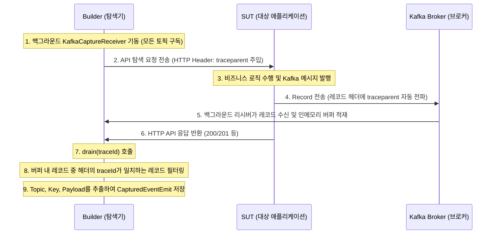

# 스펙 설계서: 카프카 아웃바운드 발행(Produce) 캡처 및 검증 지원

## 1. 배경 및 목적
현재 시스템은 SUT가 카프카 이벤트를 소비(Consume)하는 경우만 `KafkaConsumer` 및 `KafkaExchange`를 통해 캡처 및 테스트 생성을 지원합니다. API 요청(HTTP)의 결과로 SUT가 외부로 메시지를 발행(Produce)하는 경우, 발행 유무 및 메시지 데이터(Topic, Key, Payload)의 정합성을 검증할 방법이 누락되어 있습니다.

본 스펙은 **OpenTelemetry(OTEL) 분산 추적(traceId)**과 **실제 카프카 브로커 직접 구독**을 결합한 **하이브리드(Hybrid) 캡처 메커니즘**을 도입하여, SUT가 발행하는 카프카 이벤트를 정확하게 귀속 캡처하고 이를 통합 테스트에서 자동 검증하도록 설계합니다.

---

## 2. 핵심 아키텍처 및 캡처 메커니즘 (하이브리드 방식)

SUT에 부착된 순정 `otel-javaagent.jar`는 카프카 메시지 페이로드 전체를 span 속성에 로깅하지 않으므로, 아래와 같은 하이브리드 수집 방식을 취합니다.



---

## 3. 데이터 모델 설계 (`shared-model`)

### 1) `CapturedEventEmit` 신설 (Record)
* **경로**: `shared-model/src/main/java/io/graphrag/model/CapturedEventEmit.java`
* **정의**:
  ```java
  package io.graphrag.model;

  import com.fasterxml.jackson.databind.JsonNode;

  public record CapturedEventEmit(
          String id,            // 고유 ID (예: emit-<pathId>-1)
          String pathId,        // 대상 ExploredPath ID
          String topic,         // 발행된 카프카 토픽명
          String key,           // 카프카 레코드 Key (nullable)
          JsonNode payload      // 메시지 본문 Payload (JSON)
  ) {}
  ```

### 2) `ExploredPath` 확장
* **경로**: `shared-model/src/main/java/io/graphrag/model/ExploredPath.java`
* **추가 필드**: `List<String> capturedEventEmitIds`
* **호환성**: 생성자에서 `null`을 빈 리스트(`List.of()`)로 정규화합니다.

### 3) `GraphAsset` 확장
* **경로**: `shared-model/src/main/java/io/graphrag/model/GraphAsset.java`
* **추가 필드**: `List<CapturedEventEmit> capturedEventEmits`
* **호환성**: 생성자에서 `null`을 빈 리스트(`List.of()`)로 정규화합니다.

---

## 4. 빌더 탐색 및 수집 명세 (`graph-rag-builder`)

* **`KafkaCaptureReceiver` 구현**:
  * 빌더가 시작될 때 `--kafka-bootstrap` 주소가 지정되면 백그라운드 스레드로 리시버를 띄웁니다.
  * `AdminClient`를 통해 대상 브로커의 모든 토픽을 조회하거나 와일드카드 패턴(`. *`)으로 구독합니다.
  * 수신된 `ConsumerRecord<String, String>`을 `ConcurrentLinkedQueue`에 수집하며, 레코드의 헤더(`headers()`)에서 `traceparent` 바이트 어레이를 추출해 문자열로 디코딩 및 보관합니다.
* **`drain(traceId)` 동작**:
  * API 응답 수집 직후, `OtelSpanCapture`에 귀속된 `traceId`와 동일한 `traceId`를 가진 레코드들을 백그라운드 큐에서 안전하게 추출합니다.
  * 레코드의 value가 유효한 JSON 포맷인지 파싱하여 `JsonNode` 타입의 payload로 복원하고, `CapturedEventEmit` 구조체로 변환하여 반환 및 저장소에 누적합니다.

---

## 5. 테스트 코드 생성 및 검증 명세 (`test-generator` / `testlib`)

### 1) `testlib` `KafkaHelper` 확장
* 테스트 격리를 보장하기 위해 매 테스트 실행 전 고유한 `groupId`를 생성하여 Consumer를 띄우는 수신 함수를 보강합니다.
  ```java
  public ConsumerRecord<String, String> consumeNextRecord(String topic, Duration timeout) {
      // 헬퍼 구현을 통해 지정한 토픽에서 다음 레코드 1건을 안전하게 꺼내옴
  }
  ```

### 2) 테스트 코드 단언(Assertion) 합성
* `TestSynthesizer`와 테스트 템플릿(`test-class.mustache`)에서 `ExploredPath`에 `capturedEventEmitIds`가 있을 시, REST Assured 검증문 바로 아래에 다음 Assert 코드를 덧붙여 생성합니다.
  ```java
  org.apache.kafka.clients.consumer.ConsumerRecord<String, String> emitRecord = 
          kafkaHelper.consumeNextRecord("{{{topic}}}", java.time.Duration.ofSeconds(3));
  org.junit.jupiter.api.Assertions.assertNotNull(emitRecord, "이벤트가 발행되지 않았습니다: {{{topic}}}");
  {{#key}}
  org.junit.jupiter.api.Assertions.assertEquals("{{{key}}}", emitRecord.key());
  {{/key}}
  org.skyscreamer.jsonassert.JSONAssert.assertEquals(
          "{{{payload}}}", 
          emitRecord.value(), 
          org.skyscreamer.jsonassert.JSONCompareMode.LENIENT
  );
  ```

---

## 6. 완료 기준 (Definition of Done) 및 인수 테스트
1. SUT가 외부 호출을 받아 이벤트를 발행하는 E2E 샘플(`order-service` 등의 API)을 준비합니다.
2. 빌더가 탐색을 성공적으로 완수하고 `GraphAsset`에 `CapturedEventEmit`이 정상적으로 수집/기록되어야 합니다.
3. 생성된 테스트 코드 내에 `kafkaHelper.consumeNextRecord` 및 `JSONAssert` 구문이 정상적으로 들어가 있어야 하며, 해당 테스트를 재실행했을 때 전체 패스(Green)를 기록해야 합니다.
