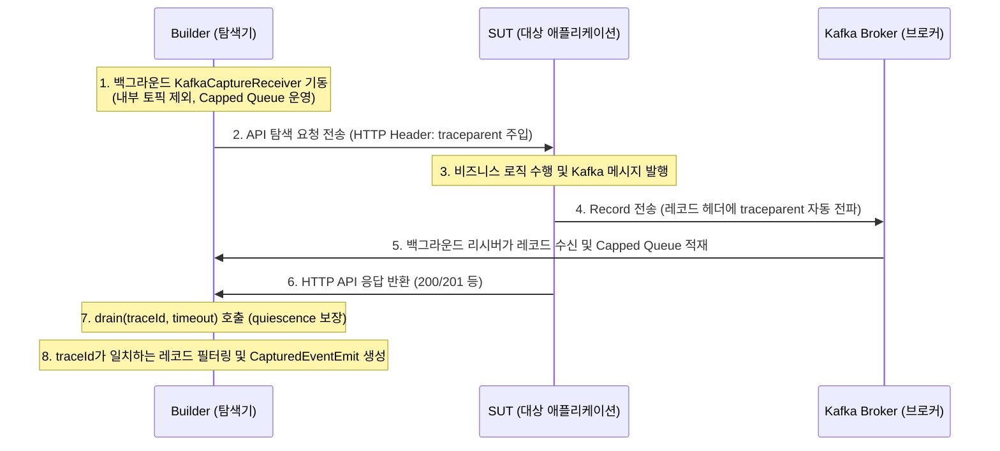

# 스펙 설계서: 카프카 아웃바운드 발행(Produce) 캡처 및 검증 지원 (v2)

## 1. 배경 및 목적
SUT가 API 요청(HTTP)을 처리한 결과로 외부 시스템에 이벤트를 발행(Produce)하는 경우, 발행 유무 및 메시지 데이터(Topic, Key, Payload)의 정합성을 검증할 방법이 기존 구조에 부재했습니다.

본 스펙은 **OpenTelemetry(OTEL) 분산 추적(traceId)**과 **실제 카프카 브로커 직접 구독**을 결합한 **하이브리드(Hybrid) 캡처 메커니즘**을 도입하여, SUT가 발행하는 카프카 이벤트를 정확하게 귀속 캡처하고 이를 통합 테스트에서 자동 검증하도록 설계합니다.

---

## 2. 핵심 아키텍처 및 캡처 메커니즘 (하이브리드 방식)



* **메시지 매핑 흐름**:
  * 빌더가 시작될 때 `--kafka-bootstrap` (attach 모드) 또는 `--with-kafka` (analysis 모드)가 활성화되어 있으면 백그라운드 `KafkaCaptureReceiver`가 실행됩니다.
  * API 요청이 발생하면 `OtelSpanCapture.begin()`에서 traceparent가 발급되고, SUT가 메시지를 보낼 때 헤더에 `traceparent`가 자동 주입됩니다.
  * API 응답 수집 후 `drain(traceId, AWAIT_TIMEOUT_MILLIS)`이 호출되며, 큐에서 일치하는 `traceId` 레코드를 추출합니다.

---

## 3. 데이터 모델 설계 및 파이프라인 통합 (`shared-model` / `store`)

### 1) `CapturedEventEmit` 신설 (Record)
* **파일**: `shared-model/src/main/java/io/graphrag/model/CapturedEventEmit.java`
* **정의**:
  ```java
  package io.graphrag.model;

  import com.fasterxml.jackson.databind.JsonNode;

  public record CapturedEventEmit(
          String id,            // 고유 ID (예: emit-<pathId>-1)
          String pathId,        // 대상 ExploredPath ID
          String topic,         // 발행된 카프카 토픽명
          String key,           // 카프카 레코드 Key (nullable)
          JsonNode payload      // 메시지 본문 Payload (JSON)
  ) {}
  ```

### 2) `ExploredPath` 확장 (구 생성자 호환성 보장)
* **파일**: `shared-model/src/main/java/io/graphrag/model/ExploredPath.java`
* **변경**: `List<String> capturedEventEmitIds` 필드 추가
* **호환성 생성자**: 레코드 생성자를 오버로딩하여 기존 10-argument 호출부의 컴파일 깨짐을 방지합니다.
  ```java
  public ExploredPath(String id, String endpointId, JsonNode sampleInput, int expectedStatus,
                      JsonNode sampleResponse, List<String> capturedSqlIds, List<String> capturedHttpCallIds,
                      List<BranchRef> branchesTaken, String discoveredBy, List<String> constraints,
                      List<String> validationWarnings, List<String> requiredSeedIds) {
      this(id, endpointId, sampleInput, expectedStatus, sampleResponse, capturedSqlIds, capturedHttpCallIds,
           branchesTaken, discoveredBy, constraints, validationWarnings, requiredSeedIds, List.of());
  }
  ```

### 3) `GraphAsset` 확장 (구 생성자 호환성 보장)
* **파일**: `shared-model/src/main/java/io/graphrag/model/GraphAsset.java`
* **변경**: `List<CapturedEventEmit> capturedEventEmits` 필드 추가
* **호환성 생성자**: 기존 생성자 호출부 호환용 오버로딩 추가.
  ```java
  public GraphAsset(String sutId, String commitSha, List<Endpoint> endpoints, List<ExploredPath> paths,
                    List<CapturedSql> sql, List<TableSchema> tables, List<MapperStatement> mappers,
                    List<CapturedHttpCall> httpCalls, List<WsEndpoint> wsEndpoints, List<WsExchange> wsExchanges,
                    List<KafkaConsumer> kafkaConsumers, List<KafkaExchange> kafkaExchanges, List<RequiredSeed> seeds) {
      this(sutId, commitSha, endpoints, paths, sql, tables, mappers, httpCalls, wsEndpoints, wsExchanges,
           kafkaConsumers, kafkaExchanges, seeds, List.of());
  }
  ```

### 4) `PartitionedGraphStore` 및 클라이언트 연동
* **영속화**: `PartitionedGraphStore.save()` 시 `capturedEventEmits`를 `pathId` 기준으로 파티셔닝하여 샤드 파일에 기록하고, `load()` 시 이를 복원 및 머지하는 로직을 구현합니다.
* **증분 빌드**: `IncrementalPlan` 및 `IncrementalBuildPlanner`에 `carriedEventEmits` 필드를 연동하여 기존 탐색 결과 이월 시 데이터 소실을 방지합니다.
* **인터페이스**: `GraphRagClient` 및 `FileGraphRagClient`에 `capturedEventEmitsForPath(String pathId)` 조회 메서드를 추가합니다.

---

## 4. 빌더 탐색 및 수집 세부 명세 (`graph-rag-builder`)

* **안정적인 큐 관리 (OOM 방지)**:
  * `KafkaCaptureReceiver`의 수집 버퍼는 `ConcurrentLinkedQueue` 대신 크기 제한이 있는 RingBuffer 혹은 슬라이딩 윈도우 기반 버퍼(예: 최대 10,000개 레코드 유지, 초과 시 가장 오래된 메시지 자동 Evict)로 관리합니다.
* **Tombstone 및 비-JSON 대응**:
  * 수신된 카프카 value가 `null`이거나 JSON 파싱이 불가능한 plain text인 경우, 크래시를 방지하기 위해 `TextNode`로 래핑하여 원본을 수집하거나 경고 로깅 후 무해하게 넘어가도록 방어 처리합니다.
* **구독 토픽 필터링**:
  * 카프카의 내부 시스템 토픽(예: `__consumer_offsets`, `_`로 시작하는 메타 토픽)은 와일드카드 구독 시 제외할 수 있도록 정규식 필터(`^(?!_).+`)를 적용합니다.
* **`EndpointExplorationRunner` 연동**:
  * `doSend()` 내에서 HTTP 요청 실행 후 `KafkaCaptureReceiver.drain(traceId, timeout)`을 호출하여 비동기 발행 이벤트를 수집합니다. 수집된 결과는 `InvocationOutcome`에 실려 `ExploredPath`로 전달됩니다.

---

## 5. 테스트 코드 생성 및 검증 명세 (`test-generator` / `testlib`)

### 1) 레이스 컨디션 방지형 `KafkaHelper` 보강
* **문제**: API 호출 완료 후(Post-condition) 카프카 구독을 시작하면 조인 지연으로 이벤트를 유실하거나 과거 레코드를 캡처할 위험이 있습니다.
* **해결**: 테스트 메서드 내에서 **API 요청을 보내기 전(given 블록 직전)에 구독을 먼저 시작**하도록 헬퍼 라이브러리를 보강합니다.
  ```java
  public final class KafkaHelper implements AutoCloseable {
      // API 호출 전 특정 토픽에 대한 구독 개시
      public void subscribe(String topic) { ... }
      
      // 버퍼에 대기 중인 레코드 중 다음 1건을 조회 (동시성 격리)
      public ConsumerRecord<String, String> consumeNextRecord(String topic, Duration timeout) { ... }
  }
  ```

### 2) `Generator` 및 Mustache 템플릿 확장 (`test-class.mustache`)
* **변수 선언 및 JSON 이스케이프**:
  * `Generator.java`에서 템플릿 주입 전 JSON payload 문자열 내의 쌍따옴표를 백슬래시로 이스케이프(`jsonEscape`) 처리합니다.
  * 단언 코드 시작부에 `io.graphrag.testlib.api.KafkaHelper kafkaHelper = scope.kafka();` 선언을 동적으로 합성합니다.
* **로컬 블록 스코프 격리**:
  * 복수의 아웃바운드 메시지 단언 시 변수명 중복으로 인한 컴파일 에러를 방지하기 위해 각 검증문을 개별 중괄호 `{ ... }` 블록으로 묶어 생성합니다.
  ```java
  // API 호출 직전 미리 구독 시작 (Latest offset race 방지)
  kafkaHelper.subscribe("{{{topic}}}");

  // SUT API 호출 실행
  given()
      .contentType("application/json")
      .body(requestPayload)
      .post("/api/orders");

  // 격리된 로컬 블록 내에서 캡처된 아웃바운드 이벤트 단언
  {
      org.apache.kafka.clients.consumer.ConsumerRecord<String, String> emitRecord = 
              kafkaHelper.consumeNextRecord("{{{topic}}}", java.time.Duration.ofSeconds(3));
      org.junit.jupiter.api.Assertions.assertNotNull(emitRecord, "이벤트가 발행되지 않았습니다: {{{topic}}}");
      org.skyscreamer.jsonassert.JSONAssert.assertEquals(
              "{{{payload}}}", 
              emitRecord.value(), 
              org.skyscreamer.jsonassert.JSONCompareMode.LENIENT
      );
  }
  ```

### 3) 의존성 추가
* `testlib/build.gradle.kts`에 `org.skyscreamer:jsonassert` 의존성을 명시적으로 추가하여 생성된 테스트 컴파일 깨짐을 원천 차단합니다.

---

## 6. 완료 기준 (Definition of Done) 및 인수 테스트
1. SUT `order-service`에 주문 생성(`POST /api/orders`) 시 외부 `order.events` 토픽으로 주문 완료 메시지를 발행하는 가상 API(또는 Mock Produce 로직)를 인수 테스트 목적으로 추가 개발합니다.
2. 빌더가 이 API를 탐색할 때 `GraphAsset` 및 파티션 샤드 파일에 `CapturedEventEmit` 정보가 정상적으로 영속 기록되어야 합니다.
3. 생성된 E2E JUnit 코드에 `kafkaHelper.subscribe`, `kafkaHelper.consumeNextRecord`, `JSONAssert` 단언 코드가 완벽히 들어가 컴파일 및 전체 테스트 그린(Green)을 패스해야 합니다.
